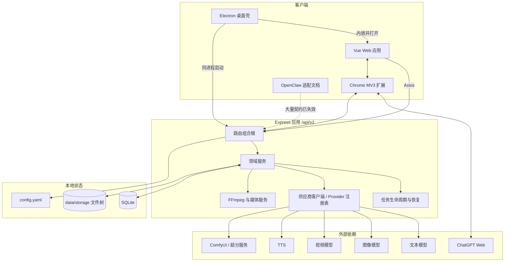
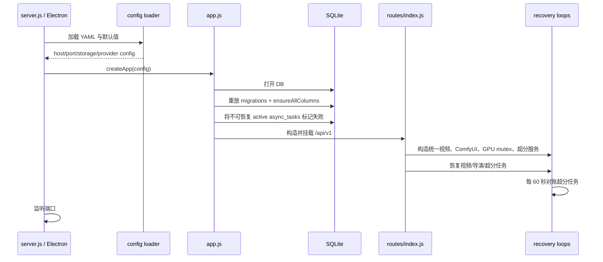
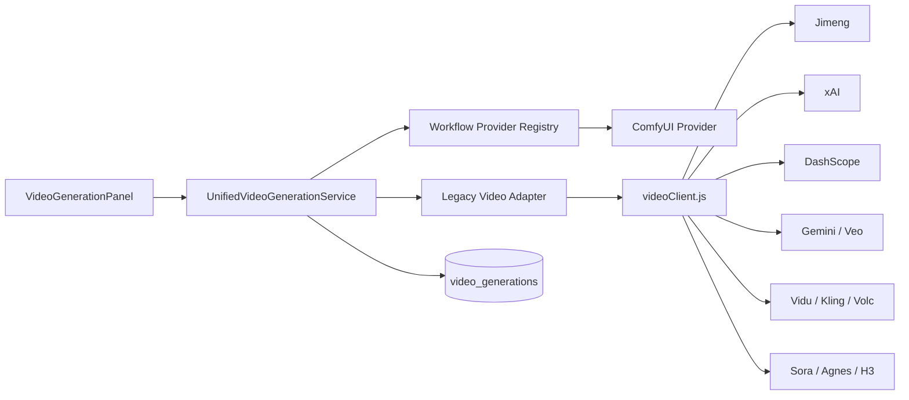
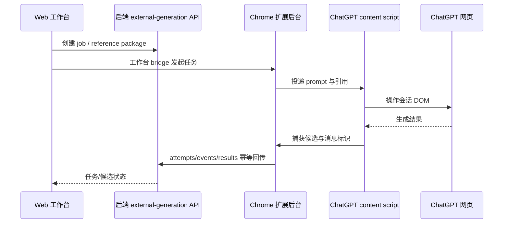

# 当前系统架构

> 本文描述仓库当前可运行架构，不提出目标态替代设计。组件评价与去留建议分别见 [code-health.md](./code-health.md) 和 [reuse-analysis.md](./reuse-analysis.md)。

## 1. 仓库与运行单元

| 目录 | 技术与职责 | 独立运行方式 |
|---|---|---|
| `frontweb/` | Vue 3 + Vite + Element Plus + Pinia + Vue Flow 前端 | Vite 开发服务器，默认 `3013` |
| `backend-node/` | CommonJS Express API、SQLite、AI 供应商调用、FFmpeg 后期 | Node 服务，默认 `5679` |
| `desktop/` | Electron 28 桌面封装，内嵌后端和前端产物 | Electron 主进程内启动 Express |
| `browser-extension/` | Chrome MV3 扩展，连接工作台与 ChatGPT 网页 | 浏览器 service worker + content scripts |
| `external-bridge/` | 可选本地 HTTP 桥，管理外部 job package/outbox | 独立 Node 服务；未接入主应用启动链 |
| `openclaw-skill/` | OpenClaw 调用说明与内存适配文档 | 非运行服务；当前接口契约已漂移 |

仓库没有 monorepo 编排工具，也没有根级统一的 build/test 脚本。各子项目独立管理依赖和测试。

## 2. 总体组件关系



## 3. 前端架构

### 3.1 页面层

| 页面 | 主要职责 | 结构特征 |
|---|---|---|
| `FilmList.vue` | 项目、示例、导入导出、公共素材库、配置入口 | 首页承担项目管理与若干全局功能 |
| `DramaDetail.vue` | 项目详情、剧集、批量脚本、项目资产、协作包 | 项目级聚合页 |
| `FilmCreate.vue` | 七阶段端到端制作 | 约 1.1 万行的巨型单文件组件，是主要产品能力的编排中心 |
| `DramaCanvas.vue` | Vue Flow 画布、节点编辑、多选、工作流组 | 与线性工作台并行的替代交互面 |
| `AiConfig.vue` / `AIConfigContent.vue` | AI 服务、映射、提示词和生成设置 | 内容组件体量接近 2,900 行，兼有独立页和弹窗入口 |
| `MediaLibrary.vue` | 通用资产浏览、上传、删除 | 当前只部分可用 |
| `FreeCreate.vue` | 非项目化图像/视频生成 | 主入口隐藏，图像任务 API 已断裂 |

### 3.2 状态层

前端只有两个主要 Pinia store 和一个项目 store：

- `film.js`：当前项目、剧集、脚本、分辨率，以及每集视频合并状态。
- `generationTaskStore.js`：按 `drama:episode:resource` 形成任务键，统一轮询故事、资产、分镜、视频、合并等通用任务；能识别陈旧任务和孤儿任务。
- `imageGenerationStore.js`：项目级图像通道、批次/任务抽屉、ChatGPT Web 环境检查、候选选择和全局队列驱动。

状态层不是纯服务缓存：它直接触发通知、设置定时器和推进队列，因此与 UI 生命周期及后端协议紧密耦合。`imageGenerationStore` 的队列驱动是单例 5 秒定时器，虽然提供停止方法，但没有发现清晰的应用级销毁调用。

### 3.3 API 层

- `request.js` 创建 Axios 实例，基址 `/api/v1`，超时 10 分钟。
- 响应拦截器解包标准 `{ success, data }`，并用 Element Plus 全局消息处理错误。
- API 文件按资源域划分，但仍有不存在的声明（例如角色/场景的 `addToTeamLibrary`）。
- 某些后端路由直接返回 `{ error }`，未遵守统一响应包，导致前端只能显示泛化错误。

## 4. 后端架构

### 4.1 启动流程



`routes/index.js` 不只是路由表，也是服务容器和生命周期组合根：它创建工作流注册表、ComfyUI 客户端、共享 GPU 互斥锁、统一视频生命周期、预处理服务，并连接合并与超分回调。这个文件掌握过多运行时装配知识。

### 4.2 服务分层

实际依赖方向大体为：

```text
Route handler
  → domain/application service
    → repository-like raw SQLite access
    → provider client / FFmpeg / filesystem
```

但层次并不严格：

- 许多 service 直接持有数据库连接并拼 SQL；没有统一 repository 层。
- 供应商请求、上传、轮询、响应归一化常集中在大型 client 文件中。
- 路由层部分承担任务创建、状态转换和响应格式处理。
- 存储路径、公共 URL 和业务实体更新分散在多个服务内。

### 4.3 API 领域

`/api/v1` 当前挂载的主要领域：

- styles、dramas、episodes、characters、character variants、scenes、props；
- character/scene/prop libraries、assets；
- storyboards、frame prompts、reference slots、H3 drafts；
- images、image batches/tasks、videos、merges、upscale；
- audio、settings、prompt overrides、scene model map、AI configs；
- director jobs/artifacts/candidates/timelines/anchors；
- episode packages、external AI packages；
- external generation jobs/attempts/events/sessions/results。

路由覆盖广，但没有 OpenAPI 或共享 schema 作为前后端契约源。

## 5. AI Provider 架构

### 5.1 文本

- OpenAI 兼容 Chat Completions 为主协议。
- DeepSeek 有推理/思考选项。
- Scene Model Map 可按场景键选择配置和模型覆盖；目前主要用于文本场景。

### 5.2 图像

`imageClient.js` 通过协议分支适配：

- OpenAI 兼容/火山；
- DashScope；
- Nano Banana；
- Kling；
- Gemini。

上层 `imageService` 负责引用图、生成记录、本地下载、资源绑定和首尾帧语义。协议层与领域持久化已有分离，但 client 自身仍接近 1,800 行。

### 5.3 视频



系统已经有统一视频生命周期，但 Provider 注册表并未覆盖所有供应商，大部分协议仍通过 4,000 余行的 `videoClient.js` 和 legacy adapter 接入。因此“统一”主要发生在任务状态与上层调用，协议实现尚未统一。

### 5.4 TTS 与后期

- TTS 支持 MiniMax 和 OpenAI 兼容协议。
- FFmpeg 通过子进程承担视频合并、音轨混合、字幕、水印、音频抽取、质量分析、锚点提取、分段拼接和验证。
- GPU 相关工作通过进程内互斥锁减少资源冲突，不是跨进程调度。

## 6. 任务与后台执行

系统没有独立 worker_threads、进程队列或消息中间件。后台执行由 Express 进程中的 `setImmediate`、`setTimeout`、Promise、轮询器和 FFmpeg 子进程完成。

### 6.1 四套主要任务模型

| 模型 | 持久化 | 恢复 | 取消语义 |
|---|---|---|---|
| 通用 `async_tasks` | 有 | 重启后将遗留 active 标记失败 | 仅改记录，不能保证中止外部调用 |
| 图像 batch/task | 有 | 可由前端重新附着，外部网页通道有会话/事件记录 | 可取消任务；批次缺少统一 cancel 入口 |
| 统一视频 generation | 有 | 保存 provider task id 和配置快照，可恢复轮询 | 支持 cancel/retry/resume |
| 视频超分 job/segment | 有 | 启动恢复 + 60 秒轮询 | 支持 retry/skip/cancel |

导演工作流另有 `director_jobs`、artifact 和 candidate 状态，外部网页生成又有 job/attempt/event/result 状态。这些模型各自合理，但没有共享状态词汇、重试政策和观测接口。

### 6.2 视频状态

统一视频服务把 `waiting/queued/running` 视为活动态，把 `review/selected/failed/cancelled/interrupted` 视为终态或可操作态。候选先进入 review，再由用户选定；这使“生成成功”和“产品采纳”成为两个不同事件，是正确的制作语义。

### 6.3 超分状态

```text
pending → waiting_provider → starting_provider → uploading
→ queued → running → downloading → stitching → validating → completed
                                               ↘ failed / cancelled / skipped
```

分段记录使大视频可以局部重试，并支持进程重启后继续查询远端状态。

## 7. 数据与本地文件

### 7.1 SQLite

- 默认数据库：`backend-node/data/drama_generator.db`。
- 当前实库 46 张业务表，WAL 模式。
- 当前 Better SQLite3 连接报告 `PRAGMA foreign_keys=1`，但应用初始化没有显式设置该值；更关键的是绝大多数业务关系根本没有声明数据库外键。
- `user_version=0`，也没有迁移记录表。

### 7.2 文件存储

默认根目录为 `backend-node/data/storage`，并通过 `/static` 暴露。主要布局包括：

```text
storage/
├─ projects/{project-id}_{date}_{frozen-label}/...
├─ library/{character|scene|prop|...}/...
├─ director-artifacts/...
├─ external-web/...
└─ uploads/...
```

数据库同时保存公共 URL 和 `local_path`。项目导出把结构化 JSON 与媒体打包；导入时重建实体和文件引用。资产软删除通常不回收文件，因此数据库生命周期和文件生命周期没有形成统一事务。

## 8. 浏览器外部生成架构



扩展用 outbox、request id、idempotency key、attempt sequence 降低页面刷新与重复提交风险。问题在于它依赖第三方 DOM 和浏览器登录状态；后端 `external_generation_jobs.status` 目前也没有随 attempt/result 实际更新，顶层状态与明细状态会漂移。

`external-bridge/` 提供另一个本地 token 与 job package 方案，但主应用没有明显启动/调用链，应视为独立实验适配器，而非生产主路径。

## 9. 配置与部署

### 9.1 Web 开发态

- Vite：`3013`；代理 `/api`、`/static` 到 `5679`。
- 后端默认监听 `0.0.0.0:5679`。
- YAML 中 CORS 默认只列出 `http://localhost:3012`，与 Vite 端口不一致；日常通过同源代理绕开。

### 9.2 Electron

- 使用固定用户数据目录，能够迁移旧目录。
- 打包态把后端工作目录设为用户数据区，并在本机空闲端口、`127.0.0.1` 上监听。
- 首次复制配置；每次启动覆盖 vendor lock 段。
- 内置 FFmpeg 不存在时才复制，保护用户已有版本。
- 开发态为兼容 native module ABI，使用生成/复制的 `desktop/backend-app`，不是直接加载 `backend-node`；副本更新流程是漂移点。

### 9.3 安全假设

当前后端没有认证/授权中间件。配置默认还能全局设置 `NODE_TLS_REJECT_UNAUTHORIZED=0`，AI 配置接口返回完整 API key。因此安全模型只能是“可信本机服务”。单独启动并监听全网卡时，这个假设被破坏。

## 10. 测试与构建结构

| 子项目 | 测试方式 | 当前观察 |
|---|---|---|
| backend-node | `node --test test/*.test.js` | 路由、服务、任务、迁移和 provider 有广泛覆盖 |
| frontweb | `node --test test/*.test.js` | composables、stores、API 逻辑等有覆盖，但 package 未提供 `test` script |
| browser-extension | `node --test` | bridge、outbox、消息协议覆盖较好 |
| external-bridge | `node --test` | 小型服务核心协议有覆盖 |

UI 级端到端测试、数据库升级矩阵、真实供应商契约测试和 Electron 打包 smoke test 仍是明显空白。

## 11. 架构结论

1. 当前是一个“模块化单体 + 桌面封装 + 浏览器扩展”的系统，不是纯前端工具，也不是分布式平台。
2. SQLite 和本地文件是同等重要的事实来源，但缺少跨两者的原子生命周期。
3. 统一视频生命周期、候选评审和超分恢复是架构中最成熟的可靠性设计。
4. 供应商接入、任务模型和实体关系仍有新旧两套或多套实现，是后续演进的主要边界问题。
5. 当前部署设计合理的目标是本机桌面；将独立 Express 直接暴露到局域网/公网不符合现有安全实现。
