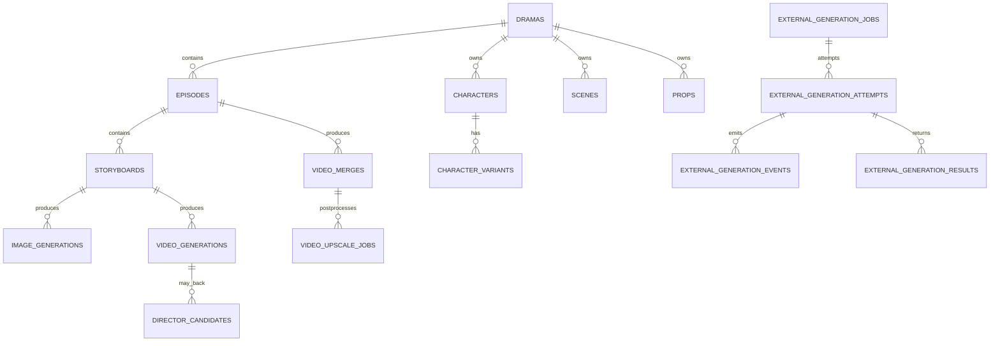

# 当前数据模型

> 数据来源：迁移脚本、`ensureAllColumns()`、服务 SQL，以及对当前 SQLite 文件的只读 schema 检查。
> 当前实库：46 张非系统表，WAL 模式；本次 Better SQLite3 连接报告 `foreign_keys=1`、`user_version=0`。应用初始化没有显式设置 `foreign_keys`。
> 本文只描述现有字段；不会把代码中计划使用但数据库不存在的字段写成既有模型。

## 1. 概念关系

注意：上图大多数是应用约定关系，不是数据库外键。当前 schema 只有以下四个显式外键：

- `external_generation_attempts.job_id → external_generation_jobs.id`
- `external_generation_events.attempt_id → external_generation_attempts.id`
- `external_generation_results.attempt_id → external_generation_attempts.id`
- `video_upscale_segments.job_id → video_upscale_jobs.id`

当前依赖版本的连接会执行这四个约束，但应用没有显式固定 `foreign_keys` pragma；其余大量关系仍无法由数据库阻止孤儿记录。

## 2. 项目、内容与资产表

### `dramas`

`id`、`title`、`description`、`genre`、`style`、`tags`、`thumbnail`、`total_episodes`、`total_duration`、`status`、`metadata`、`created_at`、`updated_at`、`deleted_at`、`style_id`。

`metadata` 实际承载画幅、生成设置、图像通道、文件夹标签、`canvas_layout`、`workflow_groups` 等多类项目状态。

### `episodes`

`id`、`drama_id`、`episode_number`、`title`、`script_content`、`description`、`duration`、`video_url`、`thumbnail`、`status`、`created_at`、`updated_at`、`deleted_at`、`audio_plan`、`production_profile`。

### `characters`

`id`、`drama_id`、`name`、`role`、`description`、`personality`、`appearance`、`image_url`、`local_path`、`voice_style`、`sort_order`、`created_at`、`updated_at`、`deleted_at`、`identity_anchors`、`style_tokens`、`color_palette`、`four_view_image_url`、`polished_prompt`、`stages`、`seedance2_asset`、`negative_prompt`、`extra_images`、`error_msg`、`ref_image`、`seedance2_voice_asset`、`image_updated_at`、`source_key`、`asset_mode`。

### `character_variants`

`id`、`character_id`、`source_key`、`name`、`description`、`appearance`、`image_prompt`、`negative_prompt`、`image_url`、`local_path`、`extra_images`、`is_default`、`created_at`、`updated_at`、`deleted_at`、`asset_mode`、`use_identity_reference`。

### `scenes`

`id`、`drama_id`、`episode_id`、`location`、`time`、`prompt`、`image_url`、`local_path`、`storyboard_count`、`status`、`created_at`、`updated_at`、`deleted_at`、`negative_prompt`、`polished_prompt`、`extra_images`、`ref_image`、`error_msg`、`image_updated_at`、`source_key`、`state`、`atmosphere`、`description`、`asset_mode`。

### `props`

`id`、`drama_id`、`name`、`type`、`description`、`prompt`、`image_url`、`local_path`、`created_at`、`updated_at`、`deleted_at`、`episode_id`、`negative_prompt`、`extra_images`、`ref_image`、`error_msg`、`image_updated_at`、`source_key`。

### `assets`

`id`、`drama_id`、`name`、`type`、`category`、`url`、`local_path`、`file_size`、`mime_type`、`width`、`height`、`duration`、`image_gen_id`、`video_gen_id`、`created_at`、`updated_at`、`deleted_at`。

实际表没有 `description`、`thumbnail_url`、`is_favorite`，但 `assetService.update` 允许这些字段进入 SQL，这是确定的代码—schema 不一致。

### `episode_characters`

`episode_id`、`character_id`，以两列构成复合主键。

## 3. 素材库与风格表

### `character_libraries`

`id`、`drama_id`、`name`、`category`、`image_url`、`local_path`、`description`、`tags`、`source_type`、`source_id`、`created_at`、`updated_at`、`deleted_at`、`appearance`、`identity_anchors`、`style_tokens`、`color_palette`、`four_view_image_url`。

### `scene_libraries`

`id`、`drama_id`、`location`、`time`、`prompt`、`description`、`image_url`、`local_path`、`category`、`tags`、`source_type`、`source_id`、`created_at`、`updated_at`、`deleted_at`。

### `prop_libraries`

`id`、`drama_id`、`name`、`description`、`prompt`、`image_url`、`local_path`、`category`、`tags`、`source_type`、`source_id`、`created_at`、`updated_at`、`deleted_at`。

### `custom_styles`

`id`、`owner_id`、`version`、`spec_json`、`created_at`、`updated_at`、`deleted_at`。

### `generation_style_snapshots`

`id`、`drama_id`、`target_type`、`target_id`、`media_type`、`style_id`、`style_version`、`language`、`final_prompt`、`negative_prompt`、`references_json`、`sections_json`、`capability_validation_json`、`status`、`created_at`、`submitted_at`。

样式快照表用于保存生成时的不可变上下文，而不是只引用会继续变化的当前样式。

## 4. 分镜与引用表

### `storyboards`

`id`、`episode_id`、`scene_id`、`storyboard_number`、`title`、`description`、`location`、`time`、`duration`、`dialogue`、`action`、`atmosphere`、`image_prompt`、`video_prompt`、`characters`、`shot_type`、`angle`、`movement`、`video_url`、`status`、`created_at`、`updated_at`、`deleted_at`、`segment_index`、`segment_title`、`angle_h`、`angle_v`、`angle_s`、`narration`、`creation_mode`、`universal_segment_text`、`layout_description`、`image_url`、`local_path`、`main_panel_idx`、`composed_image`、`result`、`emotion`、`emotion_intensity`、`error_msg`、`lighting_style`、`depth_of_field`、`polished_prompt`、`continuity_snapshot`、`audio_local_path`、`narration_audio_local_path`、`first_frame_image_id`、`last_frame_image_id`、`last_frame_image_url`、`last_frame_local_path`、`image_updated_at`、`source_key`、`audio_description`、`transition`、`is_primary`、`production_metadata`。

该表同时承担镜头脚本、当前选中媒体、生成提示词、连续性和音画计划，是领域中的宽表核心。

### `storyboard_characters`

`id`、`storyboard_id`、`character_id`、`created_at`。

当前实库无记录；实际角色关联更多来自 `storyboards.characters` JSON。

### `storyboard_character_variants`

`id`、`storyboard_id`、`character_id`、`variant_id`、`reference_role`、`sort_order`、`framing_note`。

### `storyboard_props`

`storyboard_id`、`prop_id`，复合主键。

### `frame_prompts`

`id`、`storyboard_id`、`frame_type`、`prompt`、`description`、`layout`、`created_at`、`updated_at`。

### `storyboard_h3_prompt_drafts`

`id`、`storyboard_id`、`video_config_id`、`source_prompt`、`source_fingerprint`、`ai_compiled_prompt`、`final_compiled_prompt`、`compiled_prompt_hash`、`prompt_format`、`skill_version`、`skill_provenance`、`reference_snapshot`、`generation_params`、`manually_edited`、`status`、`validation_errors`、`created_at`、`updated_at`、`workflow_id`、`coverage_manifest`、`semantic_review_status`、`semantic_review_confirmed`。

## 5. 通用与图像任务表

### `async_tasks`

`id`、`type`、`status`、`progress`、`message`、`resource_id`、`created_at`、`updated_at`、`completed_at`、`error`、`result`、`deleted_at`。

状态主要为 `pending`、`processing`、`completed`、`failed`。该表记录持久化，但执行体仍在当前 Node 进程内。

### `image_generation_batches`

`id`、`drama_id`、`resource_scope`、`generation_channel`、`status`、`total_count`、`completed_count`、`review_count`、`failed_count`、`created_at`、`updated_at`。

### `image_generation_tasks`

`id`、`drama_id`、`target_type`、`target_id`、`generation_channel`、`provider`、`model`、`prompt_snapshot`、`reference_manifest`、`aspect_ratio`、`frame_type`、`status`、`batch_id`、`queue_position`、`image_generation_id`、`external_job_id`、`error_code`、`error_message`、`created_at`、`updated_at`、`completed_at`、`asset_mode`、`negative_prompt_snapshot`、`style_snapshot`。

状态集合包含 `draft`、`queued`、`preparing`、`submitted`、`generating`、`needs_review`、`completed`、`failed`、`cancelled`。

### `image_generations`

`id`、`storyboard_id`、`drama_id`、`scene_id`、`character_id`、`provider`、`prompt`、`negative_prompt`、`model`、`frame_type`、`reference_images`、`size`、`quality`、`image_url`、`local_path`、`status`、`task_id`、`completed_at`、`error_msg`、`created_at`、`updated_at`、`deleted_at`、`episode_id`、`use_first_frame_layout_lock`、`width`、`height`、`external_job_id`、`external_attempt_id`、`external_result_id`、`source_hash`、`source_url`。

### `image_proxy_cache`

`id`、`cache_key`、`proxy_url`、`created_at`。

## 6. 视频、合成与超分表

### `video_generations`

`id`、`drama_id`、`storyboard_id`、`provider`、`prompt`、`model`、`duration`、`aspect_ratio`、`image_url`、`first_frame_url`、`last_frame_url`、`reference_image_urls`、`video_url`、`local_path`、`status`、`task_id`、`scene_id`、`completed_at`、`error_msg`、`created_at`、`updated_at`、`deleted_at`、`resolution`、`seed`、`camera_fixed`、`watermark`、`provider_task_id`、`protocol`、`config_id`、`config_snapshot`、`width`、`height`、`frame_rate`、`negative_prompt`、`continuity_mode`、`anchor_id`、`candidate_group_id`、`source_prompt`、`compiled_prompt`、`prompt_format`、`prompt_compiler_version`、`prompt_compile_status`、`prompt_compile_error`、`h3_skill_name`、`h3_skill_sha256`、`h3_skill_provenance`、`reference_audios`、`started_at`。

该表是视频请求、供应商任务标识、编译提示词和产物路径的主要事实源；候选选择另通过 `candidate_group_id` 连接 Director 候选模型，并最终回写分镜当前视频。

### `video_merges`

`id`、`episode_id`、`drama_id`、`title`、`provider`、`model`、`status`、`scenes`、`task_id`、`created_at`、`deleted_at`、`merge_options`、`merged_url`、`duration`、`completed_at`、`error_msg`、`upscale_job_id`、`base_merged_url`。

### `video_upscale_jobs`

`id`、`episode_id`、`video_merge_id`、`async_task_id`、`provider`、`method`、`workflow_id`、`config_snapshot_json`、`source_path`、`source_fingerprint`、`source_width`、`source_height`、`source_fps_num`、`source_fps_den`、`source_frame_count`、`source_has_audio`、`target_width`、`target_height`、`output_path`、`remote_input_name`、`status`、`progress`、`current_stage`、`error_code`、`error_message`、`retry_count`、`next_retry_at`、`waiting_since`、`cancel_requested_at`、`created_at`、`started_at`、`completed_at`、`updated_at`。

### `video_upscale_segments`

`id`、`job_id`、`segment_index`、`start_frame`、`requested_frame_count`、`overlap_frames`、`remote_input_name`、`client_id`、`prompt_id`、`filename_prefix`、`status`、`progress`、`remote_result_json`、`local_output_path`、`retry_count`、`error_code`、`error_message`、`created_at`、`submitted_at`、`completed_at`、`updated_at`。

## 7. 导演与候选表

### `director_jobs`

`id`、`status`、`attempt_number`、`max_attempts`、`lease_expires_at`、`error_code`、`error_message`、`input_json`、`workflow_id`、`workflow_version`、`artifact_path`、`artifact_id`、`created_at`、`updated_at`、`started_at`、`completed_at`。

### `director_artifacts`

`id`、`job_id`、`attempt_number`、`version`、`status`、`artifact_path`、`parent_artifact_id`、`sha256`、`file_size`、`ffprobe_json`、`manifest_json`、`created_at`、`ready_at`。

### `director_candidate_groups`

`id`、`shot_id`、`status`、`selected_candidate_id`、`selected_artifact_id`、`selected_by`、`selected_at`、`selection_reason`、`created_at`、`updated_at`。

### `director_candidates`

`id`、`group_id`、`artifact_id`、`job_id`、`status`、`error_code`、`error_message`、`created_at`、`updated_at`、`video_generation_id`。

### `director_timelines`

`id`、`version`、`status`、`input_json`、`manifest_json`、`ffmpeg_command`、`output_path`、`output_sha256`、`ffprobe_json`、`created_at`。

### `director_anchors`

`id`、`source_artifact_id`、`derived_artifact_id`、`frame_number`、`reference_role`、`reference_use`、`prompt_label`、`source_sha256`、`parameters_json`、`created_at`。

这些表体现了“生成结果不是成片，先形成可评审 artifact/candidate，再选择进入时间线”的生产模型。

## 8. 外部网页生成表

### `external_generation_jobs`

`id`、`drama_id`、`storyboard_id`、`asset_type`、`provider`、`site`、`conversation_id`、`prompt_snapshot`、`prompt_hash`、`reference_manifest_hash`、`reference_manifest_json`、`reference_package_path`、`status`、`created_at`、`updated_at`、`completed_at`、`image_generation_task_id`。

当前实库中该表记录均停留在 `pending`，但 attempts/results 已有完成和导入结果；代码也未发现 job 状态更新 SQL。这是确定的聚合状态漂移。

### `external_generation_attempts`

`id`、`job_id`、`conversation_id`、`user_message_id`、`assistant_message_id`、`request_id`、`sent_prompt_hash`、`sent_reference_manifest_hash`、`status`、`sequence`、`created_at`、`updated_at`、`completed_at`。

### `external_generation_events`

`id`、`attempt_id`、`idempotency_key`、`sequence`、`event_type`、`payload_json`、`created_at`。

### `external_generation_results`

`id`、`attempt_id`、`result_set_id`、`provider_result_id`、`result_index`、`node_fingerprint`、`source_url`、`source_mime`、`source_width`、`source_height`、`download_hash`、`image_generation_id`、`asset_id`、`status`、`created_at`、`updated_at`、`candidate_index`、`selected`。

### `external_generation_sessions`

`id`、`drama_id`、`site`、`browser_profile_id`、`tab_id`、`conversation_id`、`status`、`last_seen_at`、`created_at`、`updated_at`。

### `external_generation_idempotency`

`idempotency_key`、`operation`、`response_json`、`created_at`，其中 `idempotency_key` 为主键。

## 9. 导入、配置与提示词表

### `episode_imports`

`id`、`episode_id`、`schema_name`、`schema_version`、`source_filename`、`source_sha256`、`raw_json`、`normalized_json`、`match_decisions`、`generator_metadata`、`imported_at`、`import_report`、`task_package_id`、`task_created_at`、`task_assets_digest`。

### `external_ai_package_tasks`

`id`、`package_id`、`drama_id`、`target_episode_id`、`target_episode_number`、`assets_digest`、`context_markdown`、`instructions_markdown`、`asset_manifest_json`、`asset_snapshot_json`、`response_schema_json`、`created_at`、`imported_at`。

### `ai_service_configs`

`id`、`service_type`、`provider`、`name`、`base_url`、`api_key`、`model`、`default_model`、`endpoint`、`query_endpoint`、`priority`、`is_default`、`is_active`、`settings`、`created_at`、`updated_at`、`deleted_at`、`api_protocol`。

API Key 以明文列保存，当前配置 API 也返回完整值。

### `ai_model_map`

`id`、`key`、`service_type`、`config_id`、`model_override`、`description`、`created_at`、`updated_at`。

### `global_settings`

`key`、`value`、`updated_at`。

### `prompt_overrides`

`id`、`key`、`content`、`updated_at`。

## 10. JSON 字段与多重事实源

| 领域 | JSON/Text 容器 | 与之重叠的结构化模型 |
|---|---|---|
| 项目工作流 | `dramas.metadata` | 没有独立 canvas/workflow group 表 |
| 角色外观 | anchors、tokens、palette、stages、extra images、Seedance assets | `character_variants`、素材库表 |
| 分镜角色 | `storyboards.characters` | `storyboard_characters`、`storyboard_character_variants` |
| 分镜生产上下文 | continuity、production metadata、result、audio visual、streams、slots | image/video/frame prompt 表 |
| 生成请求 | request/response/reference/config/style snapshots | 当前资产和 AI config 表 |
| 剧集制作 | `audio_plan`、`production_profile` | merges、audio 生成结果与全局设置 |

生成快照使用 JSON 有合理性：它冻结生成时上下文，避免当前配置变化后无法复现。问题在于部分 JSON 同时被当作“当前事实”，与结构化关系表互相覆盖，缺少明确权威源。

## 11. 索引与一致性

当前只有少量主键、唯一键和任务相关索引。常见读取关系如：

- `episodes.drama_id`
- `storyboards.episode_id`
- `characters/scenes/props.drama_id`
- `image_generations.storyboard_id/drama_id/scene_id/character_id`
- `video_generations.storyboard_id`

没有形成系统化索引策略。小型本地项目下影响有限，但在长剧集、大量候选和任务历史下会逐渐成为瓶颈。

删除策略并不统一：部分实体使用 `deleted_at`，任务/关系表大多没有软删除，媒体记录软删后物理文件也可能继续保留。这导致统一查询、导出和清理必须记住每张表的特殊规则。

## 12. 迁移模型

当前迁移方式存在以下事实：

1. `migrations/` 中包含 01–35 号 SQL，且编号 `20` 重复。
2. 启动时按文件名排序并尝试重放所有 SQL，没有 migration ledger。
3. SQL 通过分号做简单切分。
4. “重复列/对象已存在”被当作可跳过，“表不存在”可能只警告后继续。
5. 随后约 800 行 `ensureAllColumns()` 再次创建表或补列。
6. 没有每个迁移的原子事务和已应用 checksum。

结果是“迁移脚本历史”和“启动时确保出来的最终 schema”共同定义数据库。新安装通常能得到可用库，但无法可靠证明任意旧版本升级后与新库完全等价。

## 13. 数据模型结论

- Drama → Episode → Storyboard 是最稳定的主干，应继续作为产品模型核心。
- 生成记录保留请求快照、供应商 ID 和本地结果，具备可追溯性价值。
- 最大问题是弱关系约束与多重事实源，而非字段数量本身。
- `dramas.metadata` 和 `storyboards` 已成为高耦合扩展点，继续塞入新结构会提高迁移与并发更新风险。
- 在任何模型重构前，必须先建立可重复的 schema 基线、迁移台账和旧库升级测试；否则直接规范化会有高数据丢失风险。
