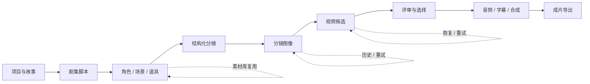

# LocalMiniDrama 当前产品模型

> 审计日期：2026-09-09
> 审计对象：当前仓库中的前端、后端、桌面壳、浏览器扩展、外部桥接器、OpenClaw 适配文档、迁移脚本与测试。
> 判定原则：只记录代码与运行时实际支持的能力，不以 README、规划文档或界面占位作为已实现依据。

## 1. 产品定位

LocalMiniDrama 是一个以“项目—剧集—分镜”为主线的本地 AI 短剧生产工作台。它把原本分散在文本模型、图像模型、视频模型、TTS、FFmpeg 和素材目录中的工作，收拢为一个可追踪的制作流程：

1. 创建短剧项目与剧集脚本；
2. 提取并维护角色、场景、道具等生产资产；
3. 将脚本拆成结构化分镜；
4. 为分镜生成首帧、尾帧或通用参考图；
5. 生成、评审、选择视频候选；
6. 合成字幕、对白、旁白、音乐并导出成片。

产品解决的核心问题不是单次“生成一张图/一段视频”，而是跨多集、跨多资产的连续生产：保持人物与场景一致性，记录生成历史，允许失败重试，并让中间结果能够被人工检查和替换。

## 2. 核心用户

| 用户 | 主要目标 | 当前产品如何支持 |
|---|---|---|
| 独立短剧创作者 | 从故事快速得到可发布视频 | 一站式脚本、资产、分镜、图像、视频和合成工作台 |
| AI 视频制作人员 | 精细控制提示词、参考图、模型和候选 | 分镜级参数、H3 草稿、首尾帧、候选组、重试和选片 |
| 小型制作团队负责人 | 管理多项目、多剧集及素材复用 | 项目/剧集层级、公共素材库、导入导出、任务状态 |
| 技术型本地用户 | 自带模型服务并控制数据落盘 | 可配置 OpenAI 兼容服务、多个图像/视频协议、ComfyUI、本地 SQLite 与文件存储 |
| 外部 AI 协作用户 | 把生成任务交给浏览器中的 ChatGPT 再回传 | 浏览器扩展、外部生成任务/尝试/结果模型；该链路仍属实验能力 |

当前产品更适合个人或小团队在可信本机/内网环境使用，并不具备多租户 SaaS 所需的账号、权限、审计和服务隔离。

## 3. 核心任务与价值链



产品价值主要来自三类闭环：

- **生产闭环**：每个阶段的输出成为下一阶段的结构化输入，而不是只能手工复制粘贴。
- **一致性闭环**：角色变体、参考图、首尾帧和连续性快照把跨镜头一致性显式化。
- **失败恢复闭环**：图像、视频、合成与超分任务有持久化状态、重试入口和部分恢复能力。

## 4. 核心实体

| 层级 | 核心实体 | 产品含义 |
|---|---|---|
| 项目 | Drama | 一部短剧的根容器，保存风格、集数、状态及大量项目级元数据 |
| 内容 | Episode | 单集脚本与制作配置 |
| 资产 | Character、CharacterVariant、Scene、Prop | 可在分镜中绑定和复用的视觉生产资产 |
| 镜头 | Storyboard | 最小制作单元，承载镜头文本、画面、提示词、音频和视频引用 |
| 生成 | ImageGeneration、VideoGeneration、AsyncTask | 对外部生成调用及结果的持久化记录 |
| 评审 | DirectorJob、CandidateGroup、Candidate、Artifact | 视频候选生产、分析和选择链路 |
| 后期 | VideoMerge、VideoUpscaleJob、VideoUpscaleSegment | 合成与超分任务 |
| 配置 | AIServiceConfig、ModelMap、PromptOverride、GlobalSetting | 模型端点、协议、路由和提示词配置 |
| 外部协作 | ExternalGenerationJob、Attempt、Event、Result、Session | 浏览器自动化生成的可靠投递和回传模型 |
| 复用 | CharacterLibrary、SceneLibrary、PropLibrary、Asset | 素材库及通用文件索引 |

完整字段和真实关联方式见 [data-model.md](./data-model.md)。

## 5. 信息与页面架构

```text
应用
├─ 项目列表 `/`
│  ├─ 项目创建 / 编辑 / 删除
│  ├─ 项目包导入 / 导出 / 示例导入
│  ├─ 公共角色 / 场景 / 道具素材库
│  └─ AI 配置入口
├─ 项目详情 `/drama/:id`
│  ├─ 项目元数据
│  ├─ 剧集管理与批量脚本导入
│  ├─ 项目资产与素材导入
│  └─ 外部 AI / 剧集包协作
├─ 线性制作台 `/film/:id`
│  ├─ 故事脚本
│  ├─ 角色
│  ├─ 道具
│  ├─ 场景
│  ├─ 分镜脚本
│  ├─ 分镜图像
│  └─ 分镜视频 / 后期
├─ 画布制作台 `/film/:id/canvas`
│  ├─ 节点图与上下文菜单
│  ├─ 分镜多选 / 工作流组
│  └─ 导演面板 / 时间线入口
├─ AI 配置 `/ai-config`
├─ 自由创作 `/free-create`（遗留且图像链路已损坏）
└─ 媒体库 `/media-library`（部分可用）
```

导航采用“项目列表 → 项目详情 → 某集制作台”的逐级深入结构。线性制作台左侧七阶段导航把复杂流程分段，画布制作台则服务于跨节点关系与批量编排。这两套工作台解决的是不同认知任务：前者强调按阶段完成，后者强调全局依赖和并行选择。

## 6. 当前核心用户旅程

### 6.1 从故事到成片

1. 用户在项目列表新建项目。
2. 在项目详情创建剧集，录入、生成或导入脚本。
3. 进入线性制作台，提取/创建角色、场景和道具。
4. 生成分镜，并逐镜修改构图、镜头、对白和提示词。
5. 批量或逐镜生成图片，选择主图/首尾帧。
6. 生成视频候选，查看状态、失败原因和历史，并选定结果。
7. 配置 TTS、字幕、水印、音频后合并视频。
8. 预览和下载成片。

该旅程已经形成主要产品闭环，但成功率依赖用户配置的外部模型；通用异步任务在进程重启后会失败，取消也不能真正中止已经发出的模型调用。

### 6.2 资产一致性维护

1. 用户维护角色主图、额外图片、四视图、身份锚点和角色变体。
2. 将角色/变体、场景和道具绑定到分镜。
3. 系统把引用快照编译进图像或视频请求。
4. 当角色变体变化时，界面展示受影响的分镜，并允许重新生成。

设计价值在于把“人物长得一样”从提示词习惯变成显式关联。但当前角色关联同时存在 JSON、关联表和变体关联表，数据模型并不统一。

### 6.3 失败处理与恢复

1. 用户发起批量图像/视频任务。
2. 前端任务抽屉展示活动任务并轮询后端。
3. 后端记录任务、供应商任务 ID、候选和错误。
4. 可恢复任务在应用重启后重新对账；失败/中断任务可重试。
5. 批量任务允许部分成功，用户可只补齐缺失项。

视频与超分具有较强的恢复设计；旧通用任务仍是进程内执行，恢复语义明显较弱。

## 7. 功能成熟度

本文档使用以下状态：

| 状态 | 含义 |
|---|---|
| `COMPLETE` | 主流程代码闭环，存在有效验证；不代表无需配置外部供应商 |
| `PARTIAL` | 主体可用，但存在缺口、只覆盖部分协议/场景，或失败恢复不完整 |
| `EXPERIMENTAL` | 有实现和入口，但处于试验、依赖特殊环境，或产品契约尚未稳定 |
| `BROKEN` | 当前代码存在确定性契约错误、占位实现或关键链路无法完成 |
| `LEGACY` | 为兼容或旧方案保留，不应继续作为主要产品能力扩展 |

成熟度概览：

| 模块 | 当前判断 |
|---|---|
| 项目、剧集和项目包 | `COMPLETE` |
| 线性制作工作台 | `COMPLETE`，但组件体量与耦合风险极高 |
| 角色/场景/道具生产 | `PARTIAL`；主 CRUD 与生成可用，某角色提取端点为占位 |
| 分镜编辑与首尾帧生产 | `COMPLETE` |
| 统一视频生成与候选选择 | `COMPLETE`，特殊供应商能力另按实验项计 |
| 一键全流程 | `PARTIAL`；依赖外部服务且旧异步任务不可可靠取消/恢复 |
| 导演、锚点与时间线 | `EXPERIMENTAL` |
| ChatGPT 网页外部生成 | `EXPERIMENTAL` |
| 媒体库 | `PARTIAL`；上传不入库、搜索参数未生效 |
| 自由创作 | `BROKEN` / 遗留入口 |
| OpenClaw 适配 | `BROKEN`；文档契约与当前 API 大量不一致 |
| 桌面打包 | `COMPLETE`，但开发态后端副本有漂移风险 |

逐项证据见 [feature-inventory.md](./feature-inventory.md)。

## 8. 产品边界

当前产品明确覆盖：

- 单机项目和素材管理；
- AI 配置与多供应商调用；
- 结构化短剧生产；
- 本地文件、SQLite、FFmpeg 后期；
- 项目/剧集包交换；
- 桌面应用和浏览器扩展辅助。

当前产品不覆盖或没有形成稳定实现：

- 账号、团队、角色权限和云端协作；
- 计费、额度、审计日志与租户隔离；
- 真正的分布式任务队列和独立 Worker；
- 服务端内容版本控制与冲突合并；
- 完整的媒体资产检索、标签治理和物理文件回收；
- 对外稳定、可生成客户端的 API 规范。

## 9. 关键结论

1. **产品闭环是真实存在的。** 项目、资产、分镜、生成、选片、后期和导出并非孤立演示页，数据库、路由、服务和测试均有对应实现。
2. **产品能力领先于架构收敛。** 新旧任务模型、直接供应商客户端与统一 Provider、线性工作台与画布工作台并存，功能增加速度已超过边界治理速度。
3. **最重要的产品资产是结构化生产模型，而不是某个供应商接入。** Drama/Episode/Storyboard、资产引用、候选选择、恢复与后期编排值得保留。
4. **当前最大风险不是功能缺少，而是“同一事实有多个表示”。** 分镜角色关系、生成结果、项目元数据和任务状态均存在多套来源，后续迭代容易产生静默漂移。
5. **部署假设必须明确为可信本机。** 无认证、明文返回密钥、全网卡监听和关闭 TLS 校验，使当前后端不适合直接暴露到不可信网络。
