# LocalMiniDrama 本地实机截图目录

> 采集日期：2026-09-08
> 环境：本地前端 `http://localhost:3013`
> 样例项目：项目 `7`、剧集 `7`，《凌晨两点的客房服务》

## 1. 证据说明

本目录中的截图用于证明调查时点的可见页面、布局、控件、内容密度和样例数据，不用于证明：

- Provider 的实际生成质量、价格或稳定性；
- 未点击弹窗内的全部字段；
- 后端状态机一定与界面文案完全一致；
- 多人协作、云发布或商业计费能力存在；
- 截图中的数量是产品固定上限。

采集过程只执行本地只读浏览、滚动、页面导航和主题切换，没有提交生成、删除、导入、导出或配置保存。

原始文件目录：[`../_artifacts/localminidrama-baseline-2026-09-08/`](../_artifacts/localminidrama-baseline-2026-09-08/)

## 2. 总目录

| 编号 | 文件 | 页面/视图 | 尺寸 | 大小（字节） | SHA-256 |
|---:|---|---|---:|---:|---|
| 01 | [项目列表](../_artifacts/localminidrama-baseline-2026-09-08/01-project-list.png) | `/` 浅色 | 1280×720 | 29,866 | `1172309b9c80262eb445c1cf47f6dfd059026432ac56250e5dd37e90943197ee` |
| 02 | [项目详情](../_artifacts/localminidrama-baseline-2026-09-08/02-project-detail.png) | `/drama/7` 全页 | 1264×1087 | 42,268 | `5038fe983635700881f472581b28434879ddddb3e1ab32acc62254acbb69280e` |
| 03 | [制作页首屏](../_artifacts/localminidrama-baseline-2026-09-08/03-production-top.png) | `/film/7` 首屏 | 1253×705 | 86,991 | `2769d8ae5a91f6e3416929a64b30b77ee761e5b1a6392caff0e41a6494a7311d` |
| 04 | [制作页全页](../_artifacts/localminidrama-baseline-2026-09-08/04-production-full.png) | `/film/7` 全页 | 1638×10234 | 854,383 | `b410d6fbd99eb9a760003fbc090a886e473fa1dc88fd3498f12bfce64c666c61` |
| 05 | [制作页资产区](../_artifacts/localminidrama-baseline-2026-09-08/05-production-assets.png) | 角色/道具/场景 | 1253×705 | 77,090 | `2fa92e7c1aaed8028fda27f95e7fbab240592fce22557a1b7ca43356bcae8e64` |
| 06 | [制作页分镜区](../_artifacts/localminidrama-baseline-2026-09-08/06-production-storyboards.png) | 分镜图片卡片 | 1253×705 | 123,412 | `bc189a5bd2be46ee0f49a0cb179dbfe411c97d040ed7419ac63ef1255eb2d53d` |
| 07 | [制作页视频区](../_artifacts/localminidrama-baseline-2026-09-08/07-production-video-section.png) | H3/视频/合片附近 | 1253×705 | 53,699 | `f31b46a5198d68541a5a6bce53a3638153633fc82b3f14032262c2dec376016c` |
| 08 | [高级画布](../_artifacts/localminidrama-baseline-2026-09-08/08-canvas.png) | `/film/7/canvas` | 1280×720 | 76,925 | `4990254f13c61b65e0ac50b6f67dcb142ca9ee9360ef69101fee6582d075b965` |
| 09 | [AI 配置](../_artifacts/localminidrama-baseline-2026-09-08/09-ai-config.png) | `/ai-config` | 1280×720 | 45,117 | `516b8f7a0aca3878d2072caf946f65402fc3fdbac99967ae616fa26cb5e4a64f` |
| 10 | [自由创作](../_artifacts/localminidrama-baseline-2026-09-08/10-free-create.png) | `/free-create` | 1280×720 | 17,945 | `6e20091f1be06e668715183f73f930d11fea6fb6748ba8c317237f1e6143dd0f` |
| 11 | [媒体库](../_artifacts/localminidrama-baseline-2026-09-08/11-media-library.png) | `/media-library` | 1265×712 | 128,482 | `d427d81df1842c35b93641286e493dbed6c990da878ad8299bb56f578ecd66b7` |
| 12 | [项目列表深色](../_artifacts/localminidrama-baseline-2026-09-08/12-project-list-dark.png) | `/` 深色 | 1280×720 | 30,623 | `5aab907c6655ce02a9c6df157274480147361a8a3ee767499330d619252ca494` |
| 13 | [制作页深色](../_artifacts/localminidrama-baseline-2026-09-08/13-production-dark.png) | `/film/7` 深色首屏 | 1253×705 | 85,967 | `fb4770f57be8a1c715c0fa4eff6b59e6577326951e3284e508d4d2cc22b01635` |

## 3. 单张截图证据卡

### 01｜项目列表（浅色）

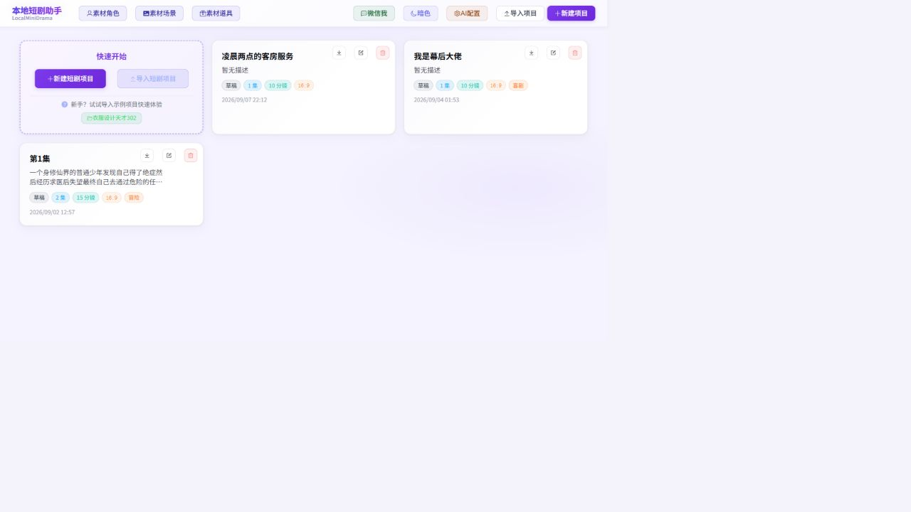

可验证事实：【A】

- 顶部包含角色库、场景库、道具库、联系、主题、AI 配置、导入和新建入口；
- 项目以卡片展示，卡片承担进入及项目操作；
- 首屏项目数量较少时存在较大留白；
- 项目级阶段进度、阻塞、运行任务和“继续上次工作”不突出。

不能据此断言：所有卡片悬浮菜单和新建/导入弹窗字段已完整覆盖。

### 02｜项目详情

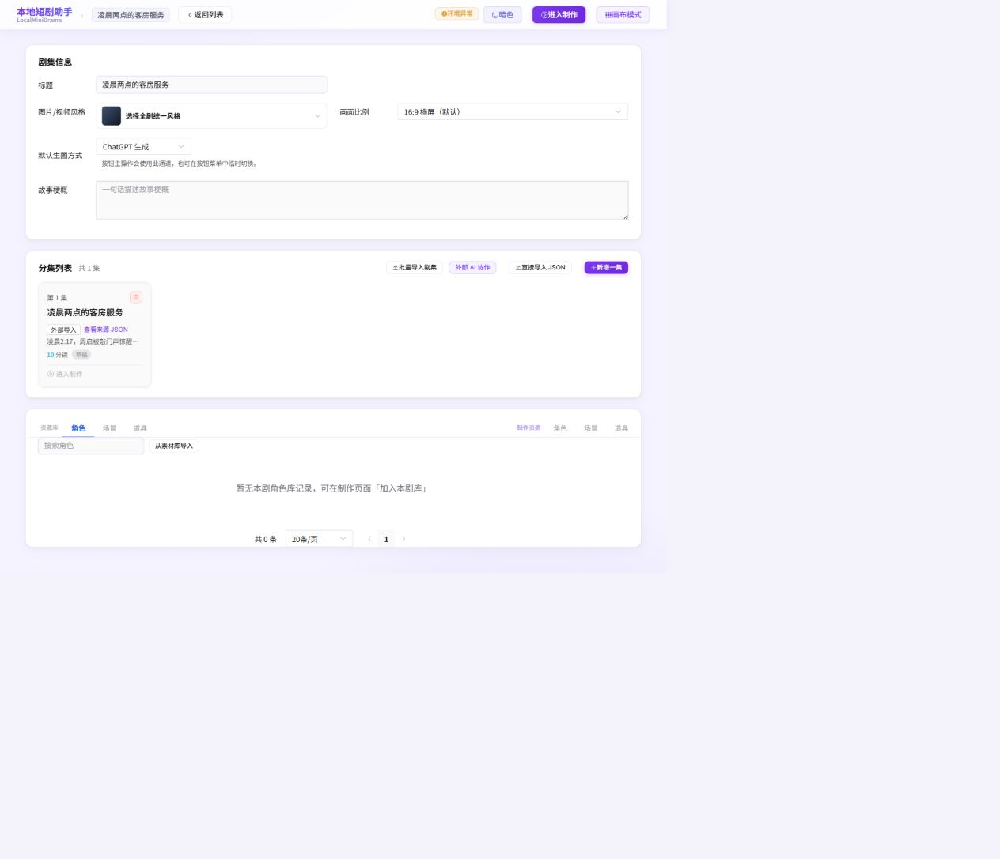

可验证事实：【A】

- 同页承载项目标题、视觉风格、画幅、默认图片 Provider/模型、剧集与资产入口；
- 支持剧集创建/批量导入以及数据/外部生成相关入口；
- 项目设置、剧集管理、资产入口和工具操作的视觉层级相近；
- 没有以四阶段展示每集完成度和阻塞项。

### 03｜制作页首屏

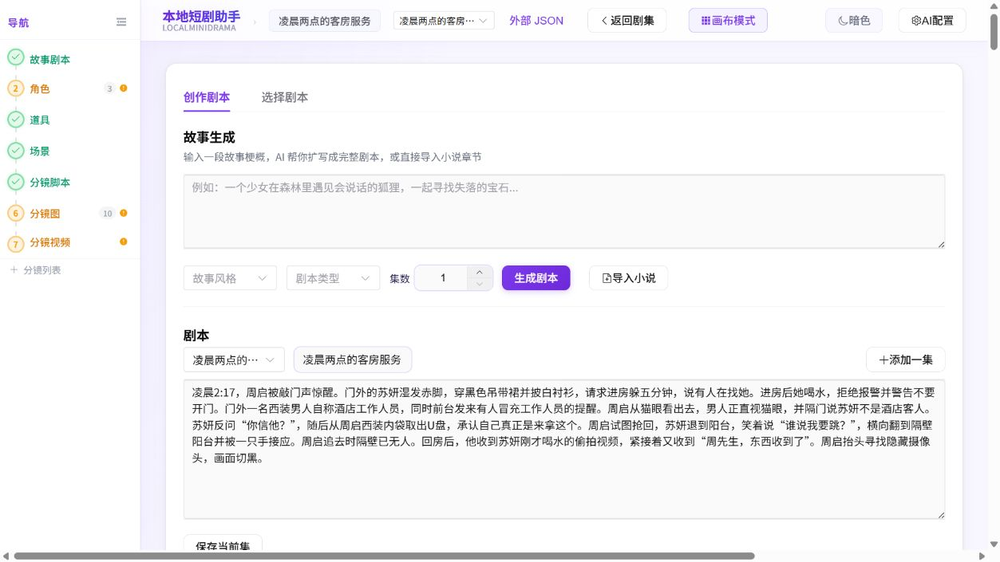

可验证事实：【A】

- 顶部同时提供返回、剧集身份、一键/批量生产、画布及多类辅助操作；
- 样例集已存在角色、道具、场景、分镜、图片和视频数据；
- 页面从剧本/全局操作直接进入大量生产内容，没有固定的阶段导航；
- 主操作、次操作、工具入口和任务进度竞争同一注意力区域。

### 04｜制作页全页

[打开 10,234 像素高的制作页全图](../_artifacts/localminidrama-baseline-2026-09-08/04-production-full.png)

可验证事实：【A】

- 一张页面纵向串联剧本、全局生成、资产、分镜、视频、音频/合片等主要环节；
- 页面完整高度超过 10,000 像素；
- 用户需要依靠滚动位置理解所处环节；
- 适合作为“拆分为阶段壳”的直接现状证据。

为避免文档渲染器缩放超长图片，本页只提供原图链接。

### 05｜制作页资产区

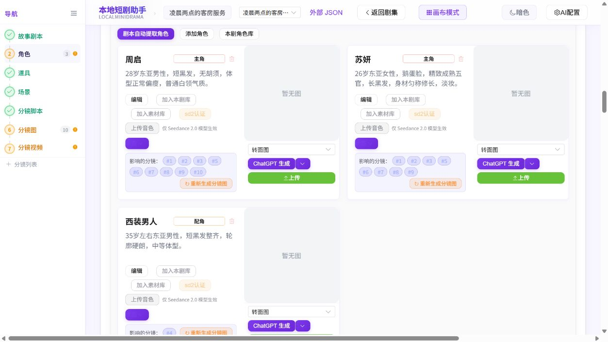

可验证事实：【A】

- 角色/道具/场景资产以包含预览、字段和多动作的宽卡片呈现；
- 区域出现横向滚动；
- 编辑、上传、生成、选择和配置等动作聚集在卡片内部；
- 当前版本、历史候选、批准状态和下游影响没有被明确分层。

### 06｜制作页分镜区

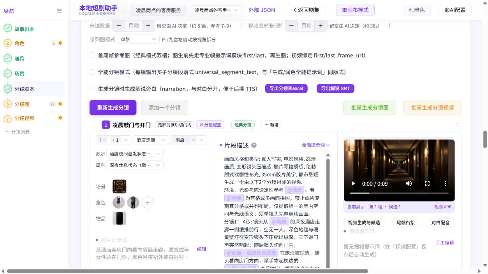

可验证事实：【A】

- 分镜卡同时承载镜头文本、资产关联、图片预览和生成控制；
- 多栏结构能提供较强的单镜控制，但信息密度高；
- 存在横向滚动，较窄屏幕下可读性下降；
- 候选对比、连续性关系和批量作用范围没有独立视图。

### 07｜制作页视频区

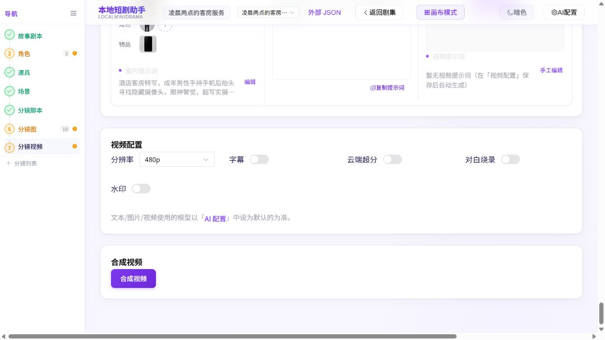

可验证事实：【A】

- 视频生产位于同一长页后段；
- H3、视频候选/生成和后续合片相关能力可从制作页到达；
- 技术型控制与最终用户决策处于相近层级；
- 没有独立的“短片/剪辑与交付”阶段壳。

### 08｜高级画布

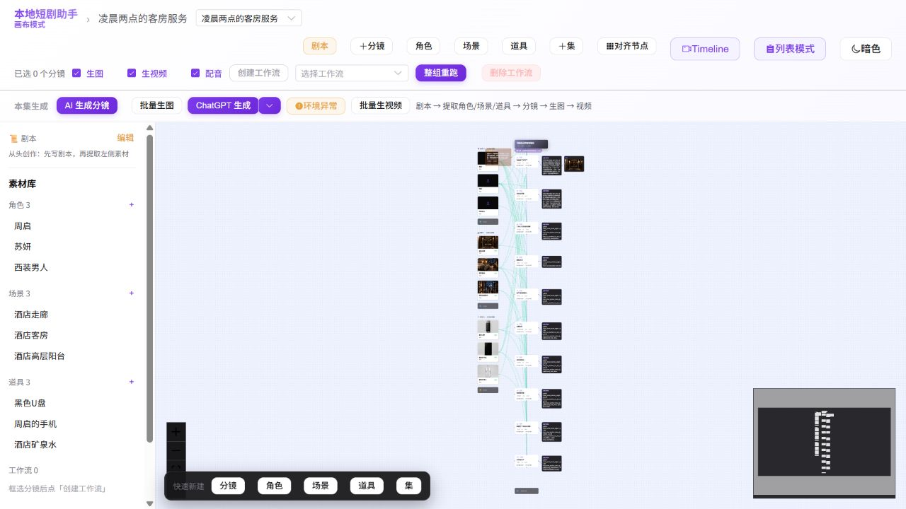

可验证事实：【A】

- 页面提供图形化节点/关系视图，并可切换列表或时间线相关视图；
- 提供工作流和批量图片/视频相关操作；
- 默认视野中节点较小，首次进入的可读性和任务导向有限；
- 画布更适合作为高级工作区，而不是替代线性主流程。

### 09｜AI 配置

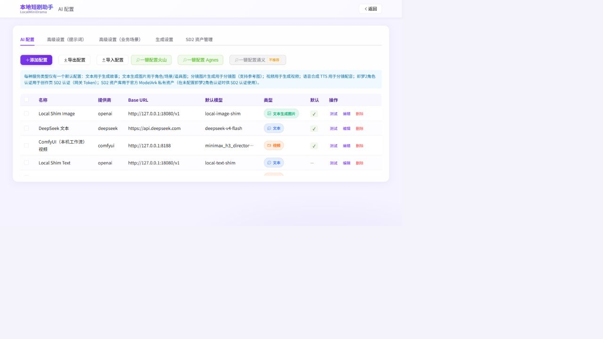

可验证事实：【A】

- 配置页承载 Provider/协议、模型、提示词、业务场景、生成参数和特定引擎设置；
- 面向高级用户的灵活性较高；
- 标签和表单密度高；
- 全局默认、业务覆盖和单次覆盖之间需要更清晰的继承说明。

敏感边界：截图只用于布局证据，不应从任何配置页截图传播密钥；本图未用来记录凭据。

### 10｜自由创作

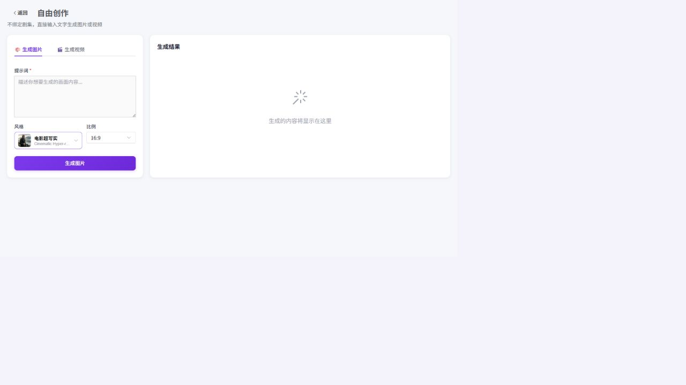

可验证事实：【A】

- 提供图片和视频的双栏快速生成入口；
- 页面比制作页简单，适合模型试验和临时素材；
- 缺少明显的项目/剧集/镜头归档上下文；
- 从项目首页发现该入口的路径较弱。

### 11｜媒体库

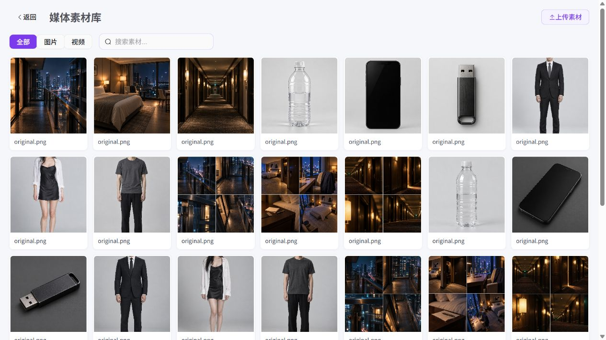

可验证事实：【A】

- 以网格聚合图片和视频，并提供基础类型筛选；
- 多张素材显示 `original.png` 等低辨识度文件名；
- 缺少项目、剧集、对象类型、Provider、状态、标签和时间等组合筛选；
- 缺少来源、使用位置、版本和批准状态的直接展示。

### 12｜项目列表（深色）

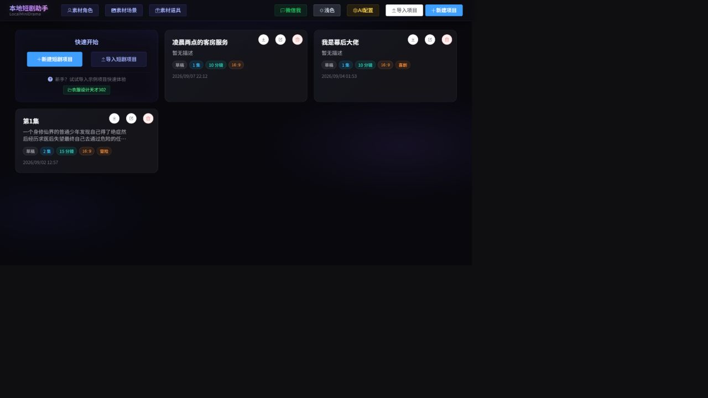

可验证事实：【A】

- 产品已支持深色主题；
- 项目列表基本结构与浅色模式一致；
- 可用于后续检查背景层级、文字对比度和强调色一致性。

### 13｜制作页（深色）

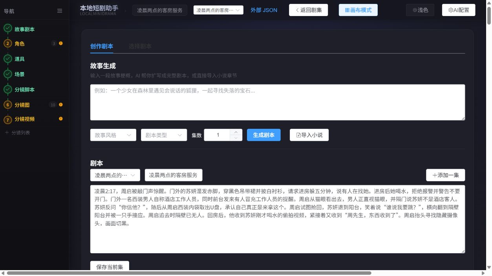

可验证事实：【A】

- 制作页支持深色主题；
- 高密度表单在深色背景下仍然存在层级和扫描负担；
- 不同组件的强调色、边框和状态色需要在 V2.1 令牌体系中统一。

## 4. 截图到设计问题的映射

| 设计问题 | 主要截图 | V2.1 处理位置 |
|---|---|---|
| 项目状态和下一步不突出 | 01、02、12 | 项目卡进度、阶段摘要、继续工作 |
| 制作页过长、无阶段导航 | 03、04、13 | Production Studio Shell + 四阶段路由 |
| 资产卡动作密集、无批准语义 | 05 | Bible Stage 资产版本与 Approval |
| 分镜卡信息密度与候选混合 | 06 | Storyboard Stage 三栏结构 + Candidate Rail |
| 视频与后期缺少独立阶段 | 07 | Cut Stage + Timeline + Delivery Gate |
| 高级画布任务导向弱 | 08 | 高级视图、统一领域 API、影响图 |
| AI 配置继承关系不清 | 09 | Provider Capability 与配置作用域说明 |
| 自由创作无法顺畅归档 | 10 | 保存到项目/资产/镜头的语义化动作 |
| 媒体库缺少 provenance | 11 | 资产筛选、来源、使用位置、版本关系 |
| 主题视觉不统一 | 12、13 | 统一颜色/层级/状态令牌 |

## 5. 后续复采规则

当 V2.1 页面进入实现后，应在相同窗口宽度至少复采：项目列表、项目详情、四阶段首屏、任务抽屉、候选比较、错误/空状态、画布、媒体库以及浅色/深色模式。新截图不得覆盖本目录原始文件，应以实现日期建立新证据目录，保留前后对比。

## 6. Production Studio V2.1 目标态原型截图

> 证据等级：**D｜目标设计原型**，不是当前业务代码的实机实现。
> 当前统一原型入口：[Production Studio V2.1 完整可点击原型](./production-studio-v2.1-full-prototype.html)
> 原始文件目录：[`../_artifacts/localminidrama-production-studio-v2.1-prototype-2026-09-08/`](../_artifacts/localminidrama-production-studio-v2.1-prototype-2026-09-08/)

这组截图专门补齐方案 B 的早期目标交互，不与第 2 节的 As-Is 证据混用。截图统一为 1600×1000 深色桌面视图。2026-09-09 已确认新的职责边界：首次正式视频生成归分镜，短片归整集审核、时间线、后期和交付。因此 T01、T06 中旧“仅在短片生成”的画面与文字仅作历史追溯，不能作为实现依据；当前交互以统一原型、交互 UI 规格和 `STORY-CUT-001` 决策为准。

| 编号 | 文件 | 目标交互 | 大小（字节） | SHA-256 |
|---:|---|---|---:|---|
| T01 | [单时段分镜（历史画面）](../_artifacts/localminidrama-production-studio-v2.1-prototype-2026-09-08/01-storyboard-single-segment.png) | 单时段与时长映射仍有效；“分镜只编译”已被 `STORY-CUT-001` 取代 | 189,107 | `d1c23d000d2e3300f1a999386329b20ab17848eec4df0de52158dd6c7ec1f745` |
| T02 | [多时段分镜](../_artifacts/localminidrama-production-studio-v2.1-prototype-2026-09-08/02-storyboard-multi-segment.png) | 同一分镜含两个连续时段；逐时段绑定多个场景资产、角色状态和道具 | 209,349 | `0cce246852f8586390f81b9707952392835f38bea8ce9f11cacf01523f3daa17` |
| T03 | [Provider 能力阻断](../_artifacts/localminidrama-production-studio-v2.1-prototype-2026-09-08/03-provider-capability-blocker.png) | 单时段模型遇到多时段分镜时阻断请求编译，提供拆分分镜或更换模型 | 217,292 | `8b28064b4f8608204fd20fe51aa2fc04f6a07264b8089848e929827209aa6498` |
| T04 | [PromptStyleGate](../_artifacts/localminidrama-production-studio-v2.1-prototype-2026-09-08/04-prompt-style-gate.png) | 校验风格身份、正向块、负向条款和请求快照；明确不做结果视觉分析 | 176,543 | `8715498b7572a2989d6f9676ecf673932bd1143fdbba8558494a3c3e755a9291` |
| T05 | [外部 JSON 来源查看](../_artifacts/localminidrama-production-studio-v2.1-prototype-2026-09-08/05-external-json-2.1-preview.png) | Studio 只读查看唯一 `episode-package@2.1` 来源；完整导入入口不放在分镜阶段 | 197,093 | `131ccb923b68a83dfd68de7bfa7e81a002eb70ca6feb935c34f373504a6b7983` |
| T06 | [短片正式视频生成（已取代）](../_artifacts/localminidrama-production-studio-v2.1-prototype-2026-09-08/06-cut-official-video-generation.png) | 历史职责方案；当前 Cut 是镜头审核/时间线/交付，首次正式生成归 Storyboard | 111,488 | `f26f265907eb5bcf5a30c2b2eaa29fe7985c6b5e5c9178752adefaced2e804c4` |

### T01｜单时段分镜

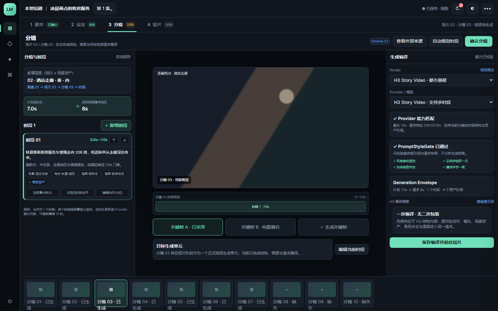

- “场次”明确为叙事容器，“场景资产”通过时段绑定；
- 分镜定义一个目标视频生成单元，单时段不是需要补齐的异常状态；截图中的旧提交位置已取代，当前在分镜阶段提交正式任务；
- 计划时长和 Provider 请求档位并列显示，避免把 15 秒误解为强制长度。

### T02｜多时段分镜

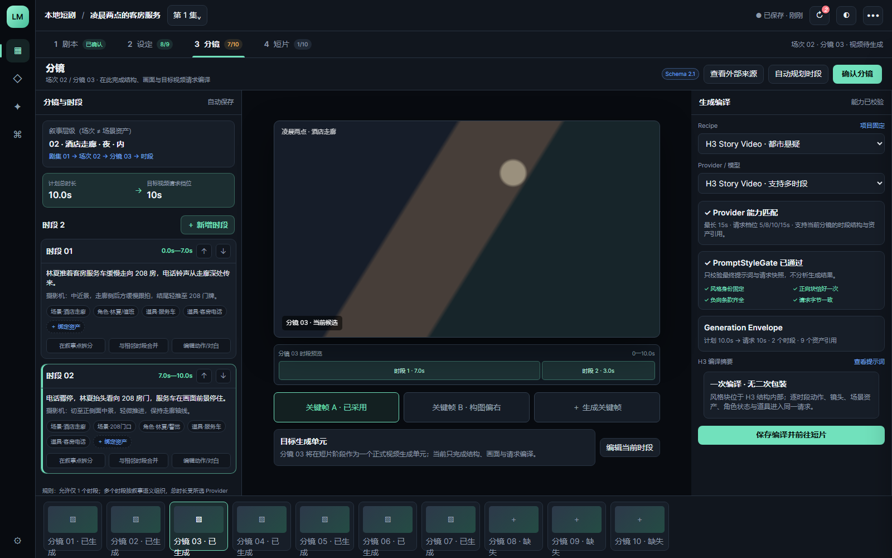

- 时段列表提供新增、叙事点拆分、相邻合并、重排和编辑；
- 每个时段独立显示场景资产、角色状态与多个道具；
- 中央时段尺展示闭合后的 7s + 3s，总计划 10s，不额外创建“视频段”层。

### T03｜Provider 能力阻断

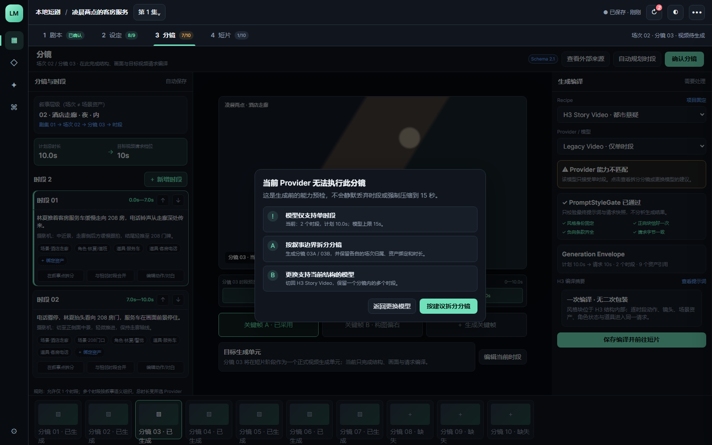

- 不支持多时段的模型不能静默删除时段，也不能强制压缩；
- 用户可选择按叙事边界拆成分镜 03A/03B，或更换支持当前结构的模型。

### T04｜PromptStyleGate

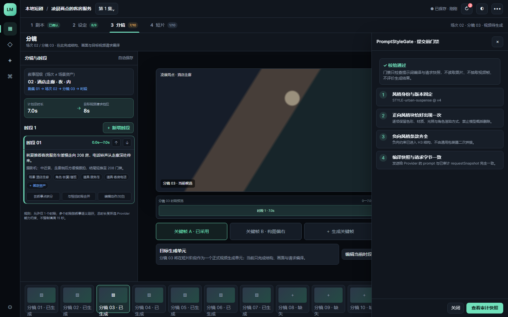

- 风格块逐项保留并在 H3 内部一次编译；
- 门禁止于最终提示词与请求快照，不包含图片理解、视频抽帧或结果评分。

### T05｜外部 JSON 2.1 来源查看

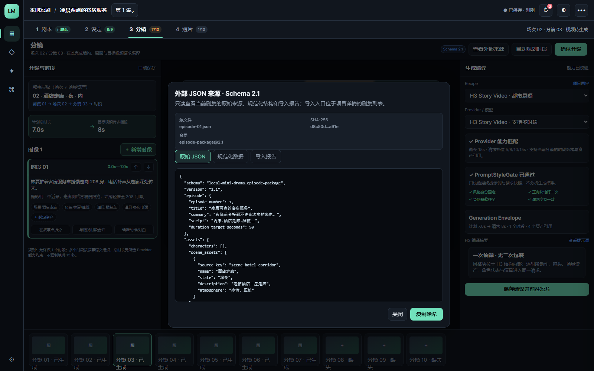

- Production Studio 只读展示原始 JSON、规范化数据、文件哈希和导入报告；
- 完整剧集制作包从项目详情/剧集列表进入，不在分镜阶段重复提供导入主按钮。

### T06｜短片阶段正式视频生成（历史方案，已取代）

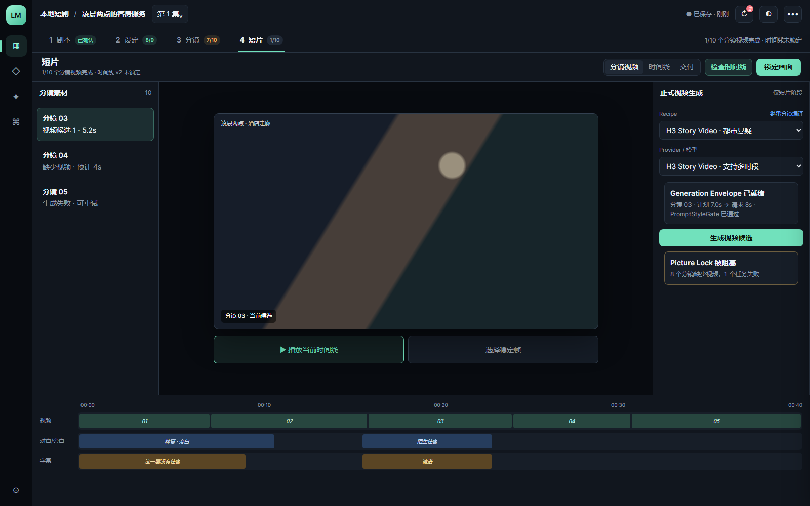

- 该截图保留 2026-09-08 的旧职责方案，不用于当前实现；
- 当前 Storyboard 读取 Generation Envelope、确认费用并生成正式 VideoCandidate；Cut 读取相同候选组做整集审核、时间线、稳定帧、重拍和交付；
- motion previs 仍是非正式产物，不能成为正式候选或进入 Picture Lock。

## 7. 项目与剧集中心目标态截图

> 证据等级：**D｜目标设计原型**，不是当前业务代码的实机实现。
> 原型入口：[项目与剧集中心可点击原型](./production-studio-v2.1-project-hub-prototype.html)
> 原始文件目录：[`../_artifacts/localminidrama-project-hub-v2.1-prototype-2026-09-08/`](../_artifacts/localminidrama-project-hub-v2.1-prototype-2026-09-08/)

| 编号 | 文件 | 目标交互 | 大小（字节） | SHA-256 |
|---:|---|---|---:|---|
| P01 | [项目列表](../_artifacts/localminidrama-project-hub-v2.1-prototype-2026-09-08/01-project-list.png) | 最近剧集、可审计阶段状态、待处理计数与继续工作 | 128,913 | `fcbc10ca3a259d6f27d4871b1f190f009ba8afb309430da7a50740c07ec0763e` |
| P02 | [项目详情与剧集列表](../_artifacts/localminidrama-project-hub-v2.1-prototype-2026-09-08/02-project-detail-episodes.png) | 项目分区、剧集阶段状态、来源标签与统一“新建/导入剧集”入口 | 132,670 | `26116ed62749f0300786720dc9e22d14db1eb0c2d8ccaffce6f324126412be8b` |
| P03 | [导入目标选择](../_artifacts/localminidrama-project-hub-v2.1-prototype-2026-09-08/03-import-target.png) | 创建新剧集或填充空白集，非空集只用于说明拒绝 | 134,818 | `324a0462955d5a4b35d405ec9213a1e02b22db176c0bbb4da0b19c1d14c743f2` |
| P04 | [分镜与时段预览](../_artifacts/localminidrama-project-hub-v2.1-prototype-2026-09-08/04-import-storyboard-review.png) | 导入向导第 4 步，检查分镜、时段、计划时长与引用 | 131,720 | `56b98ee46034fa998a8dedd2171ab3787851cb8bc0c22dfdaf84f1c5e15f39a6` |
| P05 | [非空剧集拒绝](../_artifacts/localminidrama-project-hub-v2.1-prototype-2026-09-08/05-non-empty-rejected.png) | `TARGET_NOT_BLANK`，只提供选择空白集、创建新集或取消 | 127,075 | `849f98227aebf43d28aed870522abf61037534ec85148df5e7e7c9b12166bebc` |
| P06 | [六类创建来源](../_artifacts/localminidrama-project-hub-v2.1-prototype-2026-09-08/06-six-creation-sources.png) | 新建项目与新建/导入剧集复用空白、AI、长文本、外部协作、JSON、已有视频六类来源 | 85,239 | `4fb45d7c646cfe91c92ebd1341aee46ca76ef7c6311f381620d91d95a2599391` |
| P07 | [资产匹配冲突](../_artifacts/localminidrama-project-hub-v2.1-prototype-2026-09-08/07-asset-match-conflict.png) | 未决定相似资产的复用/新建前禁止进入分镜预览 | 131,790 | `06702930732c499a747e601b3d5a557d9617a209d0d7f633f5ae1b6960f1bde8` |

### P01｜项目列表

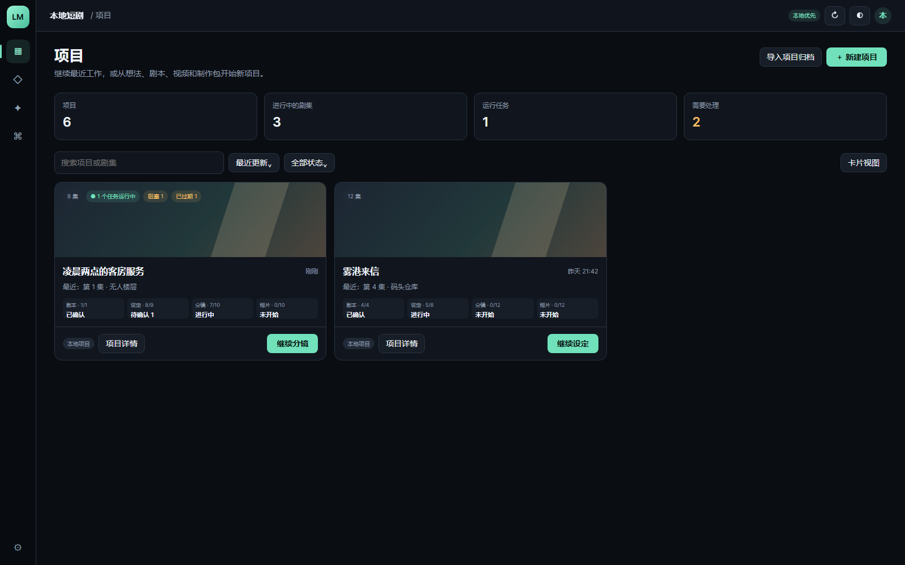

- 项目卡直接展示四阶段内容状态和可审计对象计数，并附运行任务、阻塞和最近剧集；不合成不可解释的总百分比；
- 主动作恢复最近工作位置，项目详情为次动作。

### P02｜项目详情与剧集列表

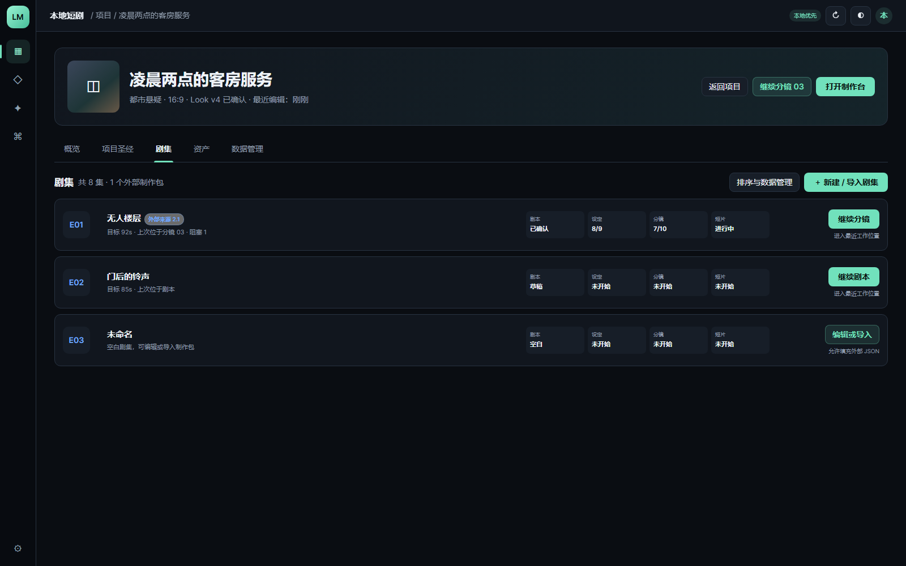

- 项目详情分为概览、项目圣经、剧集、资产和数据管理；
- “新建/导入剧集”统一打开六类来源选择器，外部导入剧集显示只读来源标签。

### P03｜导入目标选择

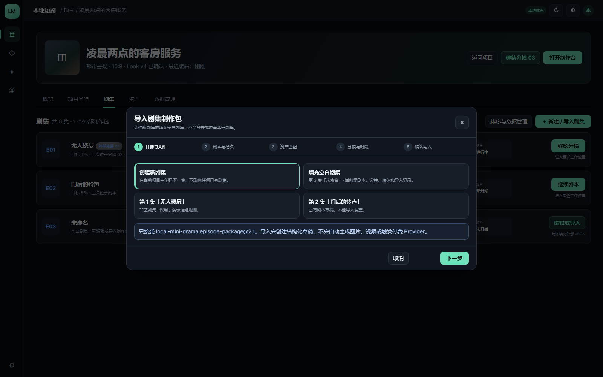

- 允许创建新剧集或填充空白剧集；
- 明示导入只创建结构化草稿，不自动生成媒体或产生 Provider 费用。

### P04｜分镜与时段预览

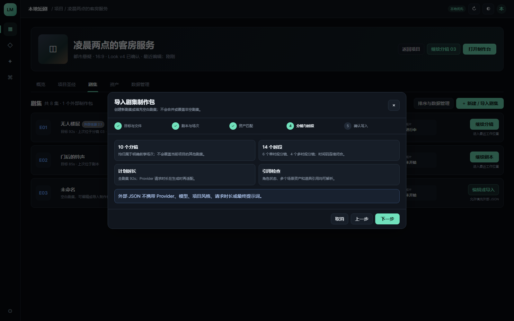

- 第四步统一检查分镜归属、单/多时段、时间闭合和多资产引用；
- Provider、模型、项目风格、请求时长与最终提示词不由外部 JSON 决定。

### P05｜非空剧集拒绝

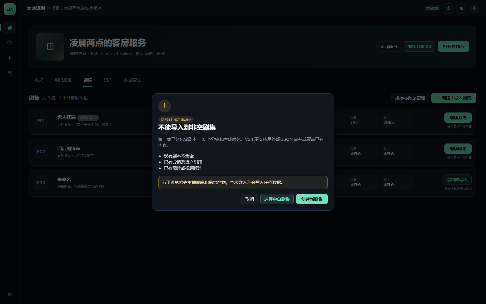

- 非空目标不进行任何写入；
- 不提供合并、覆盖、追加或忽略检查，只能选择空白集、创建新集或取消。

### P06｜六类创建来源

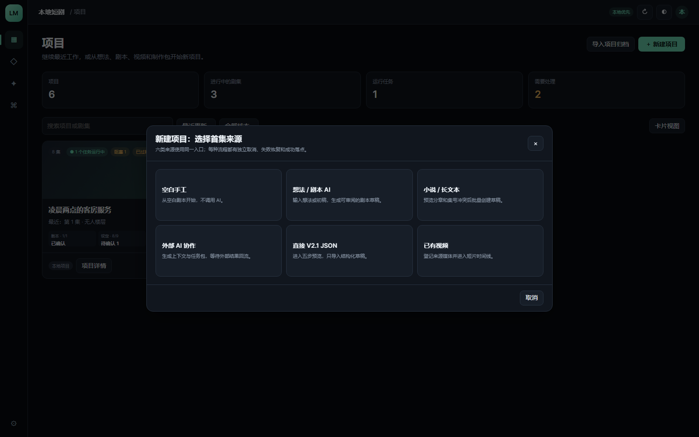

- 项目与剧集入口复用同一个来源选择器；
- 外部 AI 协作和直接 V2.1 JSON 是两个不同流程，前者存在等待回流任务，后者直接进入五步导入；
- 已有视频直接落到短片来源媒体区，不伪造剧本、设定或分镜批准。

### P07｜资产匹配冲突

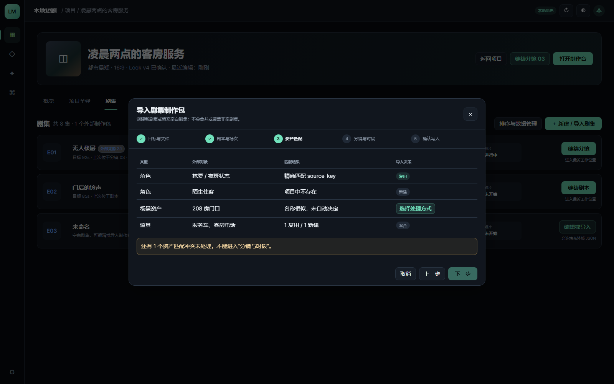

- 精确 `source_key` 可自动复用，未命中可新建；名称相似不能替用户自动决定；
- 任一冲突未处理时“下一步”禁用，必须明确选择复用或新建；
- 决策只写入导入计划，最终仍在第 5 步以单事务提交。
