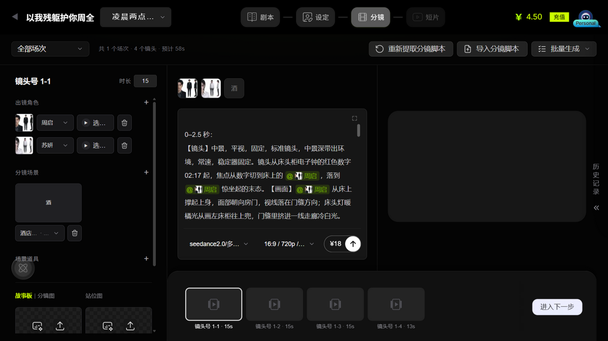
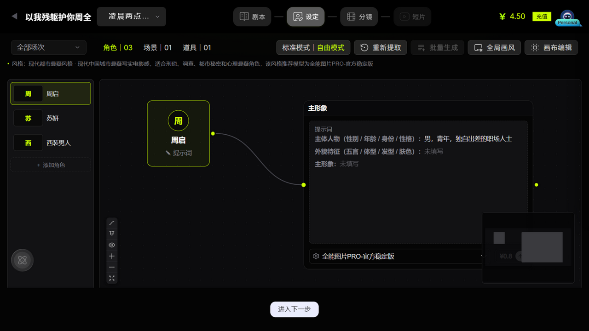

# RunningHub 截图目录

截图根目录：[`docs/research/_artifacts/runninghub-survey-2026-09-08`](../_artifacts/runninghub-survey-2026-09-08/)

## 文件索引与完整性

五张截图均为 1280×720 PNG。SHA-256 用于后续确认文件是否被重新压缩、替换或打码；文件大小为当前仓库版本。

| 编号 | 文件大小 | SHA-256 |
|---|---:|---|
| 01 | 924,546 B | `7a5d9a9ececf4538df87b0837fe6e7897710535f7865bbae4148b51cbc7ce6b1` |
| 02 | 290,407 B | `fe0c4d472dcd76cea72672226938f77dc544d8467f3cfcce66e5f6002866b8ef` |
| 03 | 243,968 B | `eff5455d9359435f23a037da5b56b9bbd7a2cc36251a29f3a2371e45f927b7b6` |
| 04 | 347,201 B | `32c184e1cca84c944c4d36996f0c036aa429ef59b4b42b95974328f463edb33b` |
| 05 | 208,703 B | `c2201df9eb2b90407615c98a5572d8c9fc9802155bf95806795cbfada46e2499` |

## 01 画风库——预设画风面板

- 页面：设定阶段的全局/局部画风选择器。
- 可验证：我的风格、全部、真人、3D、2D 分类；搜索；缩略图卡片矩阵；顶部四阶段步骤条；余额和充值入口。
- 产品意义：风格被建模为可发现、可比较、可继承的资产，而不是普通文本下拉框。
- 证据边界：画面只证明当前可见的风格分类与首屏卡片，不能仅凭截图断言画风总数、搜索质量或推荐模型的全部映射。

## 02 设定页——角色三视图卡片

- 页面：标准模式的角色资产总览。
- 可验证：角色/场景/道具分类统计；标准/自由模式；重新提取、批量生成、全局画风、画布编辑；三视图卡片；角色级音色配置；添加角色；进入下一步。
- 产品意义：资产管理、生成与阶段推进在同一工作台完成，卡片只展示摘要，复杂参数进入详情抽屉。

## 03 分镜页——三栏编辑器

- 页面：单镜头分镜制作工作台。
- 可验证：左侧资产检查器和素材槽，中间分时码提示词与模型参数，右侧结果区，底部镜头轨道；批量生成和脚本导入；故事板/分镜图/站位图分工。
- 产品意义：镜头不是一段文本，而是资产引用、时间预算、生成配置、候选结果与连续性状态的聚合根。

## 04 短片页——镜头时间线

- 页面：已进入短片阶段的《房客》第 1 集。
- 可验证：逐镜播放器、镜头完成计数、连续播放、视频增强、场次筛选、全片时间标尺、已完成/未完成片段、保存至成片门禁。
- 产品意义：分镜生成与最终审片/合片被分成两个阶段，成片是从获批镜头候选按顺序导出的派生产物。
- 证据边界：截图证明 1/29 完成时“保存至成片”不可用，但完整解锁条件由页面交叉观察和产品推断共同组成，需与接口规则再次核验。

## 05 设定页——自由模式节点画布

- 页面：设定阶段的自由模式。
- 可验证：左侧资产列表、资产节点、主形象节点、结构化角色字段、模型与价格、连线、小地图、缩放工具。
- 产品意义：标准模式和自由模式是同一数据的两种视图；自由模式暴露关系与编译过程，标准模式强调效率。
- 证据边界：截图可证明两种视图入口及节点关系；“数据完全同源”还依赖切换后的页面交叉观察，不是单张截图独立证明。

## 截图使用注意

- 截图仅用于内部产品分析和交互参考，不代表 RunningHub 官方设计规范。
- 尺寸、价格、模型、余额和项目内容是调查账号在 2026-09-08 的即时状态。
- 后续对外发布文档前应检查第三方品牌、账号信息和素材版权，并按需打码。
