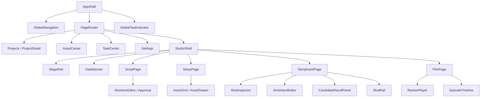

# LocalMiniDrama VNext Component Map

> 本文定义前端组件职责、状态所有权和 Current 复用边界，不指定具体文件名或实施顺序。

## 1. 组件架构

## 2. 组件层次

| 层 | 责任 | 禁止 |
|---|---|---|
| Shell | 全局/项目/剧集/阶段上下文、布局插槽 | 直接调用 Provider 或修改资产 |
| Page | 组合一个稳定工作域的 Query、Command 和局部布局 | 复制领域校验规则 |
| Feature | 完成一种业务交互，如 Approval、Batch、Selection | 直接读写多套 legacy 表 |
| Object UI | Card、List Item、Inspector section、Candidate | 自己创建全局定时器 |
| Primitive | Button、Field、Modal、Drawer、Status | 理解 Project/Shot 领域 |
| Application service | Query、Command、Gate、Job、Capability | 依赖具体视觉组件 |

## 3. App 与全局页面

| 组件 | 责任 | 输入 | 输出/事件 | 依赖 |
|---|---|---|---|---|
| `AppShell` | Global Rail、Page slot、全局覆盖层根 | route、theme、task summary | navigate | Router、TaskQuery |
| `GlobalNavigation` | Projects/Assets/Tasks/Settings | active domain、badges | navigate | 无业务 command |
| `GlobalTaskIndicator` | 活动/失败/unknown 聚合 | task projection | open task center | TaskQuery |
| `ProjectsPage` | 搜索、筛选、项目卡和 Start 入口 | project query | open/create/import | ProjectCommands |
| `ProjectCard` | 项目摘要与继续工作 | project projection | select、context action | 无直接 API |
| `ProjectDetailPage` | 剧集、资产、媒体、Delivery、交换 | project id、tab | open episode、exchange | ProjectQuery |
| `AssetCenterPage` | 跨项目资产和媒体查询 | filters、selection | open drawer、batch | AssetQuery/Commands |
| `TaskCenterPage` | 任务筛选和详情 | filters | reconcile/cancel/retry | JobQuery/Commands |
| `SettingsPage` | Provider、Workflow、生成、存储、安全 | settings route | test/save/import/export | Config schema service |

## 4. Studio Shell

| 组件 | 责任 | 输入 | 输出 | 状态所有者 |
|---|---|---|---|---|
| `StudioShell` | Project/Episode/Stage 上下文和布局 | route context | switch episode/stage | Router + EpisodeQuery |
| `EpisodeSelector` | 同项目切集 | episodes、current id | select episode | Route state |
| `StageRail` | 四阶段状态投影 | stage projection | navigate stage | Route state；不写完成状态 |
| `StageToolbar` | 阶段级筛选/批量/导入动作插槽 | stage config | feature events | 各 Page |
| `GateBanner` | 展示 block/warning/reasons/remediation | GateDecision | navigate/fix/override | Gate service |
| `StudioTaskSummary` | 当前 Episode 活动和失败 | job projection | open filtered tasks | JobQuery |
| `UnsavedChangesGuard` | 切集/切页/关闭前协调 dirty | dirty registry | save/discard/cancel | Editor state registry |

## 5. Script Components

| 组件 | 责任 | 关键状态 | 事件 |
|---|---|---|---|
| `ScriptPage` | 查询 Revision，组合场次、编辑器和底栏 | loading/error/current draft | create/import/generate |
| `StorySceneNavigator` | 结构导航、警告、定位 | selected scene | select scene |
| `ScriptEditor` | 编辑 Draft 内容 | clean/dirty/saving/error | edit/save |
| `RevisionStatusBar` | Draft/Approved 摘要 | revision ids、diff count | compare/approve/history |
| `ApprovalModal` | Diff、影响与批准确认 | loading/ready/blocking | approve/cancel |
| `RevisionHistoryDrawer` | 版本只读浏览与来源 | selected revision | create draft from revision |

`ScriptEditor` 不直接计算 downstream stale；Approval command 由后端领域服务计算并返回影响。

## 6. Setup Components

| 组件 | 责任 | 复用范围 |
|---|---|---|
| `SetupPage` | 分类、筛选、标准/Canvas 和批次组合 | Character/Location/Prop |
| `AssetTypeTabs` | 类型和计数 | 三类资产 |
| `AssetFilterBar` | Story Scene、状态、来源和搜索 | Setup/Asset Center |
| `AssetGrid` | 虚拟化卡片、多选和空态 | Setup/Asset Center |
| `AssetCard` | 身份、主形象、Variant、Voice、状态 | 通过 type-specific slots 扩展 |
| `AssetDetailDrawer` | 资产身份和深度编辑外壳 | 三类共用框架 |
| `IdentitySection` | 名称、描述、类型字段 | 按 schema 扩展 |
| `VariantSection` | 语义 Variant 列表与选择 | Character/Location/Prop |
| `MediaCandidateSection` | 上传、生成、候选、选用 | 所有可视资产 |
| `VoiceProfileSection` | 声音候选、试听、绑定 | Character |
| `ProvenanceSection` | 来源、使用位置和文件状态 | 所有资产 |
| `ExtractionMergeModal` | 提取差异和字段决策 | 三类资产聚合 |
| `StyleSelectorModal` | StyleSpec 搜索、预览和应用 | Project/Asset/Shot |
| `BatchPreflightModal` | 范围、跳过、Capability、成本 | Setup/Storyboard |
| `SetupCanvas` | P2 关系投影 | 同一 Asset Query/Commands |

共用 Drawer 框架不等于把三类字段合并；Character、Location、Prop 使用明确 schema section。

## 7. Storyboard Components

| 组件 | 责任 | 输入 | 事件 |
|---|---|---|---|
| `StoryboardPage` | 当前 Shot、Timeline 和三栏布局 | episode/shot route | select/save/generate |
| `ShotInspector` | 引用、时长、Story Scene 和验证摘要 | ShotPackageQuery | bind/unbind/update |
| `ReferenceBindingList` | 稳定引用及 valid/stale 状态 | bindings/capability | select/replace/accept fallback |
| `ShotIntentEditor` | beat、对白、旁白、镜头、prompt | ShotRevision draft | edit/save/compile |
| `ProviderParameterBar` | Provider、模型、动态参数和成本 | capability/schema | configure/preflight/generate |
| `CapabilityIssueList` | block/warning 与修复 | GateDecision | remediation |
| `CandidateResultPanel` | 当前选用、比较、历史和任务 | candidates/selection/jobs | preview/select/retry/post-process |
| `CandidateCard` | 媒体、来源、参数、成本、质量 | Candidate projection | compare/select/context action |
| `JobInlineStatus` | 当前对象任务 | Job projection | cancel/reconcile/details |
| `ShotRail` | 虚拟化序列、选择、多选、拖拽 | TimelineRevision | select/reorder/context action |
| `ShotRailItem` | 镜号、时长、缩略图、状态 | Shot projection | select |
| `TimelineEditBar` | dirty、总时长、undo/save | timeline draft | save/undo |

H3、Omni、首尾帧、Director 等特有能力通过 `ProviderExtensionPanel`/feature slot 接入，不向核心组件复制任务逻辑。

## 8. Film Components

| 组件 | 责任 | 输入 | 事件 |
|---|---|---|---|
| `FilmPage` | 审片、问题和交付组合 | episode/timeline/lock | select shot/lock/deliver |
| `ReviewToolbar` | 完成数、问题筛选、连续播放 | review projection | filter/play/lock |
| `ReviewPlayer` | Shot/Delivery 播放 | selected media | play/pause/seek |
| `IssuePanel` | missing/stale/unselected/audio issues | issue projection | open shot/remediate |
| `EpisodeTimeline` | Story Scene、Shot、时长和锁定 | timeline projection | select/reorder in draft |
| `PictureLockModal` | 锁定前清单和确认 | GateDecision、timeline | create lock |
| `DeliveryModal` | 后期配置和预检 | picture lock/capabilities | create delivery |
| `DeliveryCard` | 产物、状态、配置、下载 | Delivery projection | preview/download/retry |

## 9. Shared Components

| 组件 | 责任 |
|---|---|
| `StatusBadge` | 统一状态、图标和可访问文本 |
| `StateBoundary` | Loading/Empty/Error/Content 的局部布局 |
| `InlineError` | 用户原因、建议和技术详情 |
| `StaleIndicator` | 来源版本、reason 和修复入口 |
| `MediaFrame` | 图片/视频 skeleton、错误、processing 和比例 |
| `SelectionToolbar` | 多选数量、筛选外数量和退出 |
| `CostEstimate` | estimated/actual/unknown/local |
| `ProvenanceLink` | 打开来源详情 |
| `ConfirmDialog` | 单一高影响确认 |
| `DetailDrawer` | 统一焦点、dirty guard 和 sticky actions |
| `ModalFrame` | 统一焦点圈定、标题、内容和 footer |
| `VirtualizedCollection` | 大量资产、候选、Shot 的渲染基础 |

## 10. Application Services

前端组件只消费以下稳定边界：

| Service | 责任 |
|---|---|
| `ProjectQuery/Commands` | 项目/剧集读取与命令 |
| `RevisionQuery/Commands` | Draft、Diff、Approval |
| `AssetQuery/Commands` | Identity、Variant、Selection、Merge Preview |
| `ShotPackageQuery/Commands` | ShotRevision、Reference、Timeline |
| `CapabilityService` | 动态 schema、兼容性、默认值和估算 |
| `GateService` | allow/warning/block 与 remediation |
| `JobQuery/Commands` | submit/cancel/retry/reconcile/batch |
| `CandidateQuery/Commands` | compare/select/delete guard |
| `ReviewQuery/Commands` | issues、PictureLock、Delivery |
| `ExchangeService` | package validate/preview/import/export |

服务可在迁移期适配 Current API 和表，但组件看不到 legacy 差异。

## 11. 状态所有权

| 状态 | 所有者 |
|---|---|
| Project/Episode/Revision/Asset/Shot/Job/Candidate | 后端领域与 Query cache |
| 当前 route/shot id | Router |
| Drawer/Modal 开关、hover、comparison selection | 局部 UI state |
| 批量 selection set | Page feature state，可序列化到 session |
| Editor draft | Editor local state + draft persistence |
| Provider capability | Versioned query cache |
| Toast/Banner | Notification coordinator；不由多个 store 重复触发 |
| Polling/reconcile | Job runtime service，不属于视觉组件/Pinia view state |

## 12. Current Component Mapping

| Current | VNext 去向 | 决策 |
|---|---|---|
| `FilmList.vue` | `ProjectsPage` + 公共 Asset 入口 | 保留项目能力，拆出资产/设置对话框 |
| `DramaDetail.vue` | `ProjectDetailPage` | 增强剧集阶段和产物归属 |
| `FilmCreate.vue` | `StudioShell` + 四个 Stage Page + feature components | 渐进拆分，禁止重写后补功能 |
| `DramaCanvas.vue` | P2 `SetupCanvas` | 保留 layout/组/多选，统一 command |
| `AIConfigContent.vue` | schema-driven Settings sections | 保留所有 Provider 字段与预设 |
| `VideoGenerationPanel.vue` | `ProviderParameterBar` + `CandidateResultPanel` + extensions | 保留统一视频生命周期和特有参数 |
| `MediaLibrary.vue` | `AssetCenterPage` | 替换损坏上传/搜索契约，保留已有资产 |
| `FreeCreate.vue` | 不迁移 | 未来工具入口复用共享生成组件 |
| `generationTaskStore` | Job runtime/query adapter | 保留重连思路，移出 UI store 副作用 |
| `imageGenerationStore` | Job/Batch service + view projection | 保留外部通道，拆定时器和通知 |

## 13. 后端能力映射

组件重组不得删除：文本/图像/视频/TTS clients、统一视频服务、ComfyUI Registry、Director、H3 drafts、image batches/tasks、external generation、FFmpeg merge/audio、upscale recovery、package services、storage services。

这些能力通过 Capability、Job、Candidate、Delivery application services 暴露；旧路由由兼容 facade 承接。

## 14. 测试责任

| 层 | 验证 |
|---|---|
| Primitive | 九态、键盘、焦点、可访问名称 |
| Feature | Approval、Merge Preview、Batch、Selection、PictureLock |
| Page | Loading/Empty/Error、route 恢复、dirty guard |
| Application service | Gate、Capability、Job reconcile、authority mapping |
| Contract | 每个 Provider adapter、旧 API facade、包格式 |
| E2E | 从导入剧本到 Candidate；stale 局部重做；PictureLock 到 Delivery |

## 15. 组件边界验收

一个组件只有在以下问题都能回答时才可独立存在：它负责什么？输入和事件是什么？状态由谁拥有？依赖哪个稳定 service？关闭/卸载会不会停止不应停止的 Job？标准页和 Canvas 是否会通过它产生不同业务结果？
