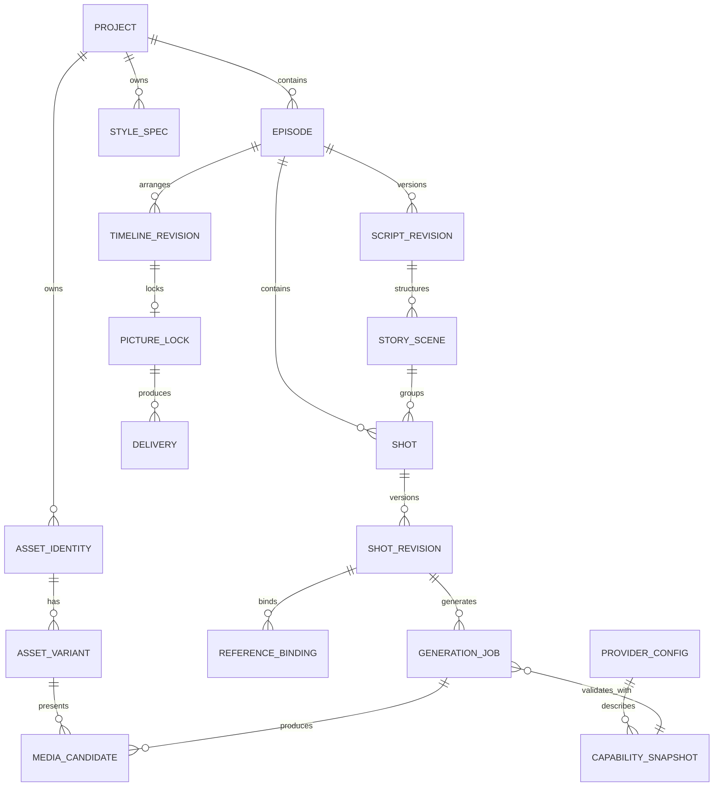

# LocalMiniDrama VNext Domain Model

> 本文定义目标领域语义、聚合边界、不变量和 Current 兼容映射，不是物理数据库 DDL。实际 Current schema 见 [current/data-model.md](../current/data-model.md)。

## 1. 建模原则

1. 保留 Current 的 Project/Drama、Episode、Storyboard 标识和媒体历史。
2. 新增模型解决“批准、依赖、候选、交付”语义，不复制已有实体。
3. Entity 表示稳定身份，Revision 表示内容版本，Candidate 表示可选结果，Artifact 表示物理产物。
4. 所有生成输入是不可变 Snapshot；当前配置只用于创建新 Snapshot。
5. stale 是状态，不是删除动作。
6. 标准页、Canvas、外部适配器都通过同一领域命令更新模型。

## 2. 领域全景



## 3. Bounded Contexts

| Context | 责任 | 主要实体 | 不负责 |
|---|---|---|---|
| Project | 项目/剧集归属、项目设置和入口 | Project、Episode | 镜头生成执行 |
| Script | 剧本版本、批准、Story Scene | ScriptRevision、StoryScene | 视觉资产媒体 |
| Asset | 稳定资产、语义变体、主形象、音色和来源 | AssetIdentity、AssetVariant、VoiceProfile、StyleSpec | 镜头顺序 |
| Shot | 镜头身份、镜头版本、引用和准备状态 | Shot、ShotRevision、ReferenceBinding | Provider 网络请求 |
| Generation | Provider 能力、Job、Attempt、Candidate、Artifact | ProviderConfig、CapabilitySnapshot、GenerationJob、Candidate、Artifact | 项目导航 |
| Review | 候选选用、时间线、锁定 | Selection、TimelineRevision、PictureLock | 修改批准剧本 |
| Delivery | 音频、字幕、合片、超分和整集产物 | Delivery、DeliveryArtifact | 重新定义镜头内容 |
| Exchange | 项目/剧集包、导入、来源与外部协作 | PackageManifest、ImportRecord、Provenance | 作为实时数据库同步 |

## 4. 核心实体

### 4.1 Project

稳定身份，对应 Current `dramas.id`。

核心属性：`id`、标题、简介、封面、默认画幅、默认语言、默认 Style Binding、存储位置、创建/更新时间、归档/删除状态。

不变量：

- 项目设置是默认值，生成 Job 必须保存实际 Snapshot；
- Canvas layout 等视图偏好可作为版本化 UI 文档，但 Workflow Group 等有生命周期对象不能继续塞入无版本 metadata；
- 删除项目必须报告数据库记录与物理文件两个结果。

### 4.2 Episode

对应 Current `episodes.id`，拥有独立阶段和交付历史。

核心引用：当前 Draft Script Revision、Approved Script Revision、Current Timeline Revision、Latest Picture Lock、Delivery 列表。

Episode 不直接保存一个“总进度百分比”作为事实；阶段与完成度由下属对象投影计算。

### 4.3 ScriptRevision

| 字段 | 语义 |
|---|---|
| `id` | 不可变 revision id |
| `episode_id` | 所属剧集 |
| `revision_number` | 剧集内单调递增 |
| `parent_revision_id` | 来源版本 |
| `content` | 该版本正文 |
| `structure_snapshot` | Story Scene/段落结构 |
| `source` | manual / generated / imported / package |
| `status` | draft / approved / superseded |
| `content_hash` | 稳定比较与依赖指纹 |
| `created_at/approved_at` | 生命周期时间 |

不变量：

- 一个 Episode 同时最多一个 Approved ScriptRevision；
- 保存 Draft 不改变 Approved；
- Approved Revision 不原地修改；
- 批准新版本后，旧批准版本变 superseded，但仍可追溯；
- Current `episodes.script_content` 在迁移期作为兼容缓存，不再是最终权威源。

### 4.4 StoryScene

叙事上的场次，来自 ScriptRevision 的结构，不等于视觉 Location。

属性：`id`、`script_revision_id`、序号、标题、正文范围、时间/叙事标签、可选默认 Location Binding。

迁移原则：Current `scenes` 不直接改名为 StoryScene；旧数据通过映射建立 StoryScene 与 Location 的关系。

### 4.5 AssetIdentity

抽象基类，具体类型为 Character、Location、Prop。Current 的 `characters`、`scenes`、`props` 继续作为兼容身份来源。

共同属性：稳定 id、project id、类型、名称、描述、source/provenance、删除状态。

类型专属字段仍保留，例如 Character 的人格/声音、Location 的氛围/时间、Prop 的类型；不创建丢失这些字段的万能资产表。

### 4.6 AssetVariant

带业务语义的资产状态，例如“角色—战损”“场景—夜间”“道具—破损”。

不变量：

- Variant 必须属于一个 AssetIdentity；
- Variant 名称/语义与媒体 Candidate 分开；
- 每个 Variant 最多一个 Selected Appearance，但可有多个历史 Candidate；
- Current `character_variants` 直接映射；场景/道具派生状态渐进接入。

### 4.7 VoiceProfile

角色声音身份，而不是某个音频文件。

包含：来源（预设/设计/上传/提取）、描述、Provider 引用、试听 Candidate、Selected Voice、许可/认证元数据。TTS Job 使用 VoiceProfile Snapshot，避免声音配置变化后历史不可解释。

### 4.8 StyleSpec 与 StyleBinding

StyleSpec 是版本化视觉规范；StyleBinding 将项目、资产或 Shot 绑定到某个版本。

继承顺序：`Shot override → Asset/Variant override → Project default → System fallback`。实际生成时将解析结果冻结为 Style Snapshot，不回读未来版本。

### 4.9 Shot

镜头稳定身份，对应 Current `storyboards.id`。镜头序列位置不属于 Shot 身份，而属于 TimelineRevision。

Shot 保存所属 Episode 和可选 StoryScene；当前编辑内容由 ShotRevision 表达。迁移期 Current storyboard 宽表继续作为兼容读写投影。

### 4.10 ShotRevision

镜头包的版本化内容：

- 目标时长、对白、旁白、动作和音画说明；
- 景别、角度、机位、运动和情绪；
- 分时码/beat；
- Reference Binding；
- Style Binding；
- Provider-neutral prompt intent；
- 模型专属编译草稿引用，例如 H3；
- 来源 Script Revision 和依赖指纹。

编辑保存产生新 revision 或版本化草稿；已被 Job 使用的 revision 不原地改写。

### 4.11 ReferenceBinding

| 字段 | 语义 |
|---|---|
| `target_type/target_id` | Asset Identity、Variant、Candidate、Artifact、相邻 Shot 等稳定目标 |
| `target_version` | 绑定的具体版本/哈希 |
| `role` | identity、style、first_frame、last_frame、composition、audio、continuity 等 |
| `required` | 是否阻塞生成 |
| `fallback_policy` | block / text_fallback / optional |
| `status` | valid / missing / stale / incompatible / text_fallback |
| `reason_code` | 可解释失效原因 |

UI 中的 `@角色名` 只是显示；底层保存 stable id 和版本。重命名或排序不能破坏引用。

### 4.12 ProviderConfig 与 CapabilitySnapshot

ProviderConfig 保存端点、协议、模型和 secret reference。Secret 不进入普通查询 DTO。

CapabilitySnapshot 至少描述：

- 输入媒体和引用角色；
- 引用数量/尺寸/格式限制；
- 时长、分辨率、比例、帧率；
- 首尾帧、音频、续画、种子、固定相机；
- 异步查询、取消、恢复和候选数；
- 参数 schema、默认值和互斥条件；
- 估算成本规则及版本；
- provider-specific extensions。

Job 必须保存使用的 Capability Snapshot 版本，不能只引用可变配置。

### 4.13 GenerationJob、Batch 与 Attempt

GenerationJob 是一次逻辑生成请求；Attempt 是一次实际执行尝试；Batch 聚合多个 Job。

Job 不可变输入：目标对象、Shot/Asset Revision、Prompt Snapshot、Reference Manifest、Style Snapshot、Capability Snapshot、Provider Config reference、估算成本。

Attempt 保存：adapter、provider task id、状态时间、请求/响应摘要、实际/未知成本、错误阶段、取消确认。

重试复用原快照时创建新 Attempt；“用当前配置重新编译”创建新 Job。

### 4.14 MediaCandidate 与 Artifact

Artifact 表示文件/远程资源及技术元数据；Candidate 表示“可被比较和选用的业务结果”，引用一个或多个 Artifact。

不变量：

- Job 成功只创建 Candidate，不自动覆盖选中结果；
- Selection 是显式动作，记录 actor、时间和 reason；
- 删除 Candidate 需要检查是否被 Asset、Shot、PictureLock 或 Delivery 引用；
- Current `image_generations`、`video_generations`、Director candidates/artifacts 通过 adapter 投影到统一模型，不要求一次物理合表。

### 4.15 TimelineRevision

包含 Episode 内 Shot 的有序引用、目标时长、转场和音频衔接。插入、删除、合并和重排产生新 TimelineRevision；不会改写旧 PictureLock 使用的序列。

### 4.16 PictureLock

冻结一个 TimelineRevision 及每个必需 Shot 的 Selected Candidate。

创建条件：所有必需镜头有选用结果、无 blocking stale、时长有效。创建后上游可继续修改，但必须产生新 Timeline/Shot Revision；旧 PictureLock 保持不变。

### 4.17 Delivery

一次整集交付请求，引用一个 PictureLock、音频计划、字幕/水印/超分配置和不可变 Delivery Snapshot。

每次成功产生独立 Delivery Artifact。Current `video_merges` 与 upscale job/segments 映射到 Delivery Job；旧输出不被新合片覆盖。

### 4.18 PackageManifest、ImportRecord 与 Provenance

项目 ZIP、剧集包和外部 AI 包使用版本化 Manifest。Import 先验证和预览，再记录来源、hash、映射决策、冲突和结果。Provenance 可追溯到包、外部会话、Provider Job 或本地上传。

## 5. 计算模型

### 5.1 StageProjection

Stage 不是用户手工维护的单一枚举，而是由领域状态计算：

| Stage | Ready 条件摘要 |
|---|---|
| Script | 存在 Draft；Approved 决定能否执行下游 |
| Setup | 批准剧本存在；已引用资产满足必要描述/媒体 |
| Storyboard | Shot/Timeline 存在；镜头可逐个达到 ready |
| Film | 必需 Shot 已选用；PictureLock/Delivery 决定交付状态 |

Episode 可以同时存在“当前工作阶段”和“各阶段完成/警告/阻塞投影”，避免单一状态丢失并行进度。

### 5.2 GateDecision

```text
GateDecision {
  action,
  outcome: allow | allow_with_warning | block,
  reasons[],
  affected_object_ids[],
  remediation_actions[],
  capability_snapshot_id
}
```

Gate 只控制命令，不控制读取页面。相同规则由 UI 预检和后端命令共同执行，后端为最终权威。

### 5.3 InvalidationRecord

当 Approved Script、Asset Variant、StyleSpec、Reference Target 或 Provider Capability 变化时，记录 source version、dependent object、reason、severity 和 resolved_by。stale 可被重新编译、重新生成、重新绑定或显式接受解决。

## 6. 状态不变量

1. `saved ≠ approved`。
2. `candidate_ready ≠ selected`。
3. `all_candidates_exist ≠ picture_locked`。
4. `picture_locked ≠ delivered`。
5. `frontend_timeout ≠ failed`。
6. `cancel_requested ≠ provider_cancelled`。
7. `stale ≠ deleted`。
8. `standard_view edit = canvas edit`，二者必须调用同一命令。
9. 任何 Artifact 被 PictureLock/Delivery 引用时，不可物理删除。
10. provider-specific extension 不得被通用 DTO 静默丢弃。

## 7. 权威事实源

| 事实 | VNext Authority | Current 兼容来源 |
|---|---|---|
| 批准剧本 | ScriptRevision | `episodes.script_content` |
| Story Scene | ScriptRevision structure / StoryScene | `scenes` 与脚本文本推导 |
| 资产身份 | Character/Location/Prop identity | `characters/scenes/props` |
| 资产主形象 | Selection → Candidate | 实体 `image_url/local_path` + image generation |
| 分镜角色/变体绑定 | ReferenceBinding | storyboard JSON + relation tables |
| 镜头内容 | ShotRevision | `storyboards` 宽表 |
| 生成输入 | GenerationJob Snapshot | 各 generation/task request/config 字段 |
| 生成结果 | Candidate + Artifact | image/video/director generation 表 |
| 当前镜头视频 | Selection | storyboard video 字段 + generation selection |
| 镜头顺序 | TimelineRevision | storyboard number/sort/segment 字段 |
| 整集成片 | Delivery Artifact | `video_merges` 与 upscale output |
| 任务状态 | Job/Attempt Projection | async/image/video/director/upscale/external 状态表 |

迁移流程统一为：`backfill → dual-read compare → authority switch → stop legacy write → legacy read-only`。禁止同时维护两个可写权威源。

## 8. 领域事件

关键事件：

- `ScriptDraftSaved`
- `ScriptRevisionApproved`
- `DependencyInvalidated`
- `AssetVariantSelected`
- `ShotRevisionSaved`
- `ShotReferencesValidated`
- `GenerationJobSubmitted`
- `GenerationAttemptReconciled`
- `CandidateProduced`
- `CandidateSelected`
- `TimelineRevised`
- `PictureLocked`
- `DeliveryRequested`
- `DeliveryCompleted`
- `PackageImported`

事件用于投影任务、阶段和通知，不要求立即引入分布式 event bus；本地事务记录即可。

## 9. 兼容与迁移约束

- 保持现有 Project/Episode/Storyboard/Character/Scene/Prop id。
- 旧脚本映射为一个明确的 initial revision；不能无提示决定它是否 approved。
- 旧实体当前图片通过 Candidate/Selection backfill 建立引用，文件不移动。
- 旧 generation 和 task 表先由 adapter 统一读取，不立即物理合并。
- `dramas.metadata` 中 Canvas layout 可版本化保留；Workflow Group 迁出前继续兼容读取。
- 项目包支持旧 manifest 读取；新导出写 VNext schema version 和 provenance。
- 所有 destructive migration 在用户数据副本上验证并可回滚。

## 10. 不进入领域模型的内容

- 页面选中 tab、Drawer 开关、滚动位置等属于 UI State；
- RunningHub 的钱包、社区、返利和品牌视觉；
- 暂不实施的 2D/3D 工程模型和视频重绘模型；
- 把“下一步按钮是否亮”当成业务状态；按钮只展示 GateDecision。
