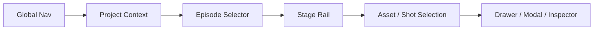

# LocalMiniDrama VNext Navigation Specification

## 1. 导航目标

导航必须让用户持续知道五件事：所在工作域、项目、剧集、阶段、当前对象。导航只改变上下文，不伪造阶段完成，也不静默绕过 Gate。

## 2. 导航层级



| 层级 | 组件 | 行为 |
|---|---|---|
| Global | Projects、Assets、Tasks、Settings | 切换顶级工作域 |
| Project | 返回、标题、项目菜单 | 保持/退出项目上下文 |
| Episode | 当前集下拉、上一集/下一集 | 在同项目切集 |
| Stage | Script、Setup、Storyboard、Film | 切换单集工作阶段 |
| Object | Scene/Asset/Shot/Timeline item | 改变当前编辑对象 |
| Overlay | Modal/Drawer | 不离开背景上下文完成局部任务 |

## 3. 路由模型

建议目标路由：

```text
/start
/projects
/projects/:projectId
/projects/:projectId/assets
/projects/:projectId/media/shots
/projects/:projectId/deliveries

/projects/:projectId/episodes/:episodeId/script
/projects/:projectId/episodes/:episodeId/setup
/projects/:projectId/episodes/:episodeId/storyboard
/projects/:projectId/episodes/:episodeId/storyboard/shots/:shotId
/projects/:projectId/episodes/:episodeId/film
/projects/:projectId/episodes/:episodeId/film/locks/:lockId

/assets
/tasks
/settings/providers
/settings/workflows
/settings/generation
/settings/storage-security
/settings/experiments
```

路由表达稳定上下文，不把 Modal 开关、选中候选 tab 或临时筛选全部写入 URL。可分享/恢复的对象（project、episode、stage、shot、picture lock）进入 URL；短暂 UI 状态留在 query/session state。

## 4. Current 路由兼容

| Current | VNext 处理 |
|---|---|
| `/` | 兼容进入 `/projects` |
| `/drama/:id` | 解析为 `/projects/:projectId` |
| `/film/:id` | 根据现有 id 语义解析项目/剧集，并恢复最后阶段；不能猜测失败后静默进入错误项目 |
| `/film/:id/canvas` | P2 映射到 Setup Canvas，保留对象/布局 |
| `/drama/:id/canvas` | 兼容别名并给出弃用遥测，不立即删除 |
| `/ai-config` | `/settings/providers` |
| `/media-library` | `/assets` |
| `/free-create` | 不迁移旧页；显示明确退役说明和统一入口 |

兼容重定向必须保留 project/episode/shot 上下文，并使用 replace history，避免返回键在新旧 URL 间循环。

## 5. Global Navigation

默认桌面为左侧窄导航或顶部紧凑导航，包含：

- Projects：默认入口；
- Assets：跨项目复用；
- Tasks：活动/失败 badge；
- Settings：Provider 与本地设置；
- Start：主动作，可位于 Projects Header。

不显示钱包、社区或发布。当前项目内 Global Nav 降低视觉权重，但始终可达。

## 6. Studio Navigation

### 6.1 Header 顺序

```text
[返回项目] [项目标题] [Episode 选择器]
        [Script] [Setup] [Storyboard] [Film]
                  [任务/阻塞] [设置]
```

阶段项同时显示：当前、已完成、警告、阻塞、stale 数。阶段选择只切页，不自动确认或推进状态。

### 6.2 软浏览、硬执行

- 任意阶段可浏览已有数据；
- 未批准剧本时 Setup/Storyboard/Film 显示 Banner；
- 执行动作向 Gate 服务查询；
- `block` 时保持当前页面，聚焦阻塞说明；
- 不把用户静默重定向到 Script；
- 修复动作可明确跳转到对应对象，并带 return target。

### 6.3 Episode 切换

切换前：

1. 检查当前 inline editor/drawer 是否 dirty；
2. 可自动安全保存的内容先保存；
3. 有冲突或未验证内容时显示确认 Dialog；
4. 切换后进入目标 Episode 的同阶段；若无数据则显示 Empty，不改到其他阶段；
5. 恢复该 Episode 上次选中 Story Scene/Shot 和滚动位置。

## 7. 对象导航

### 7.1 Script

Story Scene 列表选择只滚动/聚焦正文，不改变 Approved Revision。Revision History 打开 Drawer；选择旧版本默认只读，显式“基于此版本创建草稿”才产生变化。

### 7.2 Setup

资产类型和 Story Scene 是筛选；单击卡片是 Selection；Enter/“编辑详情”打开 Drawer。关闭 Drawer 后焦点回到原卡片。切换筛选不清空批量已选项，但必须持续显示“已选 N 项（含筛选外 M 项）”。

### 7.3 Storyboard

Shot Rail 是镜头主导航。单击 Shot 改变左中右上下文并更新 shot route。方向键选择相邻镜头；拖拽只改变 Timeline draft，保存前有 dirty 状态。

从 Film 跳回问题 Shot 时保存 return target；完成编辑后可“返回短片审核”。

### 7.4 Film

时间线选择改变播放器当前 Shot。问题筛选只改变可见/导航范围；Picture Lock 选择改变只读预览基线，不改变当前 Timeline。

## 8. Back、关闭与历史

优先级：

1. Esc 关闭最上层 Context Menu/Popover；
2. 再关闭 Modal；
3. 再关闭 Drawer；
4. 无覆盖层时浏览器 Back 按真实导航历史返回；
5. Studio 的“返回项目”始终回当前 Project Detail，不依赖浏览器历史。

任何关闭动作遇到 dirty 内容时，遵循保存/放弃/继续编辑三选一；可安全自动保存的轻量字段除外。

## 9. Deep Link 与恢复

- 进入 Shot deep link 时先加载 Project/Episode Shell，再加载 Shot；Shot 不存在时保留 Studio 并显示对象级 Error。
- 进入被删除/归档 Project 时显示可恢复说明，不跳到任意项目。
- 应用重启恢复最后安全位置；若上次停在 Modal，只恢复背景 Page/对象，不自动重开危险确认。
- 未完成 Job 不影响页面恢复；对象内联显示 reconciling。
- 导入/迁移后旧链接通过 id mapping 定位，不以列表序号定位。

## 10. Loading 与导航

- Shell 先稳定显示，内容区用骨架；不得因阶段数据 loading 导致导航抖动。
- 切换 Shot 时保留布局，Inspector/Editor/Result 分区独立 loading。
- 导航请求失败时保留上一上下文或显示局部 Error，不把整个应用替换为空白页。
- 重复点击当前导航项不重新触发昂贵加载；提供显式 Refresh。

## 11. 键盘导航

| 快捷方式 | 行为 |
|---|---|
| `Alt+1..4` | 切换 Script/Setup/Storyboard/Film；有输入焦点时不触发 |
| `[` / `]` | 上一个/下一个 Shot；编辑文本时不触发 |
| `Ctrl/Cmd+S` | 保存当前可保存草稿，不等于批准 |
| `Esc` | 按覆盖层优先级关闭 |
| `Enter` | 打开选中卡片/确认非危险轻量动作 |
| `Space` | Film 播放/暂停；输入控件中不触发 |

所有快捷方式在设置/帮助中可发现，且有按钮替代。

## 12. 移动与窄屏

VNext 是桌面生产工具：

- ≥1280px：完整多栏 Studio；
- 1024–1279px：Inspector/Result 可折叠，Shot Rail 保留；
- <1024px：支持项目浏览、任务查看、审片和轻量编辑，不承诺完整三栏生产；
- 窄屏 Drawer 转全屏 Page；不能把三栏压成三个不可用窄列。

## 13. 禁止的导航行为

- Gate 失败后 URL 留在 Film、页面却静默显示 Script；
- “下一步”同时承担保存、批准和导航；
- 标准模式与 Canvas 切换到不同数据副本；
- 删除/发布类动作占据卡片主点击区；
- 切 Episode 时丢失未保存内容却只显示 Toast；
- 用 Provider 名称作为一级创作导航；
- 关闭 Drawer 后焦点丢到页面顶部。
