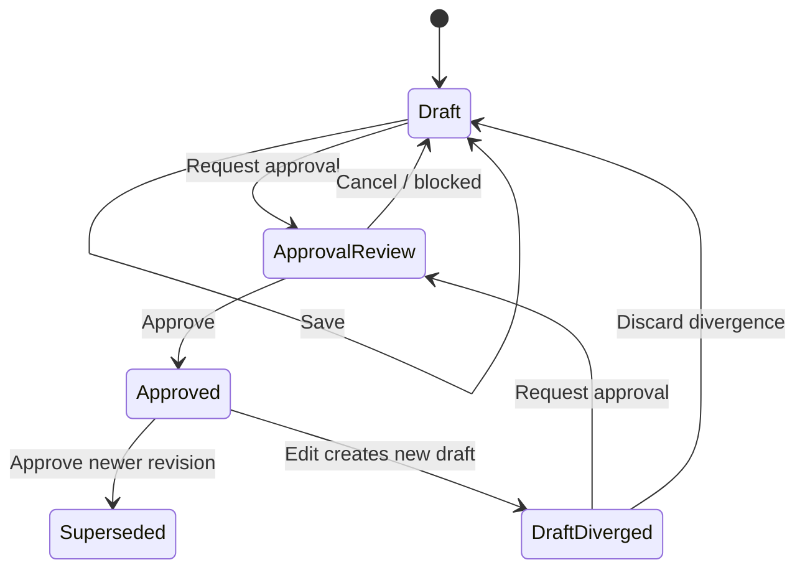
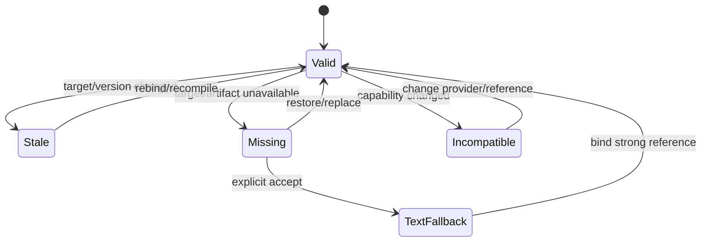
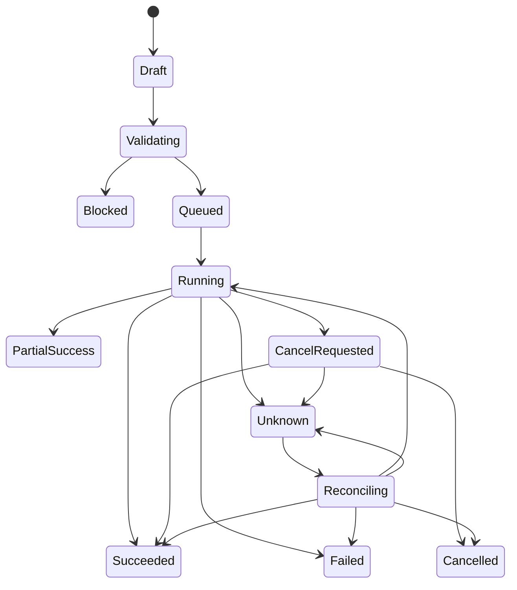
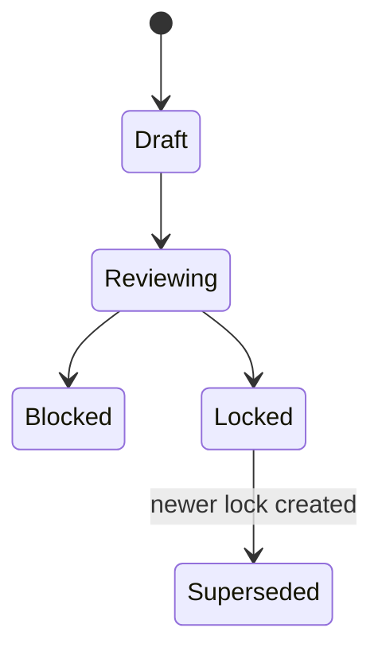

# LocalMiniDrama VNext State Model

> 本文是 VNext 状态词汇的权威规格。UI 不能用组件局部布尔值重新发明业务状态；后端领域状态为事实，前端只组合呈现。

## 1. 状态分层

一个对象的最终 UI 状态由六条正交轴组成：

```text
Data State        initial / loading / loaded / refreshing / load_error
Content State     empty / present
Interaction State default / hover / focus / selected / disabled
Validation State  valid / warning / blocked
Freshness State   current / stale / missing / incompatible / text_fallback
Process State     idle / queued / running / unknown / success / error / cancelled
```

例如一个 Shot 可以同时是 `selected + present + stale + processing`。不得把它压成单个 `status = orange`。

## 2. UI 九态

### 2.1 定义

| UI State | 触发 | 必须展示 | 必须允许/禁止 |
|---|---|---|---|
| `Default` | 数据已加载、可交互、未选中 | 正常内容、主行为、元数据 | 允许常规操作 |
| `Hover` | 指针位于可交互对象 | 表面/边框反馈，可选辅助动作 | 不写状态、不移动布局；关键动作不能只在 Hover 存在 |
| `Selected` | 当前上下文、多选或业务选用 | 非颜色标记、对象名、选择类型 | 允许取消/替换；区分 UI selection 与 business selection |
| `Disabled` | Gate/Capability/权限/进程状态禁止动作 | 当前值、禁用原因、修复入口 | 禁止命令；允许查看原因和已有结果 |
| `Loading` | 首次读取必要数据 | 保持布局的 skeleton、作用域 | 禁止依赖未加载数据的命令；不阻塞无关区域 |
| `Empty` | 成功加载但无对象/无筛选结果 | 空因、范围、一个主动作 | 允许创建/导入/清除筛选；不显示 Error |
| `Processing` | Job/保存/导入/Delivery 执行中 | 阶段、进度或不确定指示、Job 入口 | 允许离页；是否取消由 Capability 决定 |
| `Success` | 动作完成或结果可用 | 结果摘要、落点、下一动作 | 不自动覆盖 Candidate/Selection；短确认可消退 |
| `Error` | 读取、验证、执行或保存失败 | 原因、建议、reason code/Job ID | 保留输入和上次成功内容；提供重试/修复 |

### 2.2 状态组合优先级

1. 首次 `Loading` 且无旧数据：显示 skeleton。
2. `Refreshing` 且有旧数据：保留内容，只在局部显示 loading。
3. `Error` 且有旧数据：保留旧数据并显示错误；不替换成整页 Error。
4. `Processing`：叠加在对象内容上；对象身份与导航仍可用。
5. `Disabled`：作用于具体动作，不默认禁用整个卡片/Page。
6. `Selected` 始终可辨，即使对象 stale/error/processing。
7. `Hover` 是最低优先级，不覆盖 Selected/Error/Processing 标记。

## 3. Episode Stage Projection

Stage 是派生投影，不由“下一步”按钮直接写入。

| Stage | 状态 | 条件 |
|---|---|---|
| Script | `empty` | 无 Draft Revision |
| Script | `draft` | 有 Draft、无 Approved |
| Script | `approved` | 有 Approved，Draft 未分叉 |
| Script | `diverged` | Approved 后有新 Draft 修改 |
| Setup | `empty` | 无已提取/手工资产 |
| Setup | `in_progress` | 有资产但被引用项不完整 |
| Setup | `ready` | 当前下游所需资产满足规则 |
| Setup | `stale` | 来源 Script/Style/Variant 变化 |
| Storyboard | `empty` | 无 Shot/Timeline |
| Storyboard | `in_progress` | 部分 Shot 未 ready/未生成 |
| Storyboard | `ready` | Shot Package 可生成或已产生候选 |
| Storyboard | `stale` | Shot/Reference 基于旧上游 |
| Film | `in_progress` | 部分必需 Shot 无 Selection |
| Film | `ready_to_lock` | 所有必需 Shot selected 且无 blocking stale |
| Film | `picture_locked` | 存在当前 PictureLock |
| Film | `delivered` | 当前 Lock 有成功 Delivery |

“当前工作阶段”由最近访问位置保存；“完成状态”由上表计算。两者不能混同。

## 4. ScriptRevision State



| 状态 | 可编辑 | 可作为下游基线 | UI |
|---|---|---|---|
| `draft` | 是 | 否 | Draft 标记、保存状态 |
| `approval_review` | 背景只读 | 否 | Diff/影响 Modal |
| `approved` | 否；编辑产生新 Draft | 是 | Approved revision/hash |
| `draft_diverged` | 是 | 下游仍使用旧 Approved | Banner + Diff 数量 |
| `superseded` | 否 | 只供历史追溯 | History Drawer |

## 5. Editor Save State

```text
clean → dirty → saving → saved → clean
                    └→ save_failed → dirty
```

- `saved` 是短暂 UI 反馈，不等于 `approved`。
- 自动保存失败时保留本地 draft 和错误；切页触发 UnsavedChangesGuard。
- 冲突进入 `conflict`，展示服务端版本、本地版本和合并选择，不静默 last-write-wins。

## 6. Asset State

### 6.1 Asset Identity

| 状态 | 含义 |
|---|---|
| `draft` | 手工新建或提取候选，尚未确认必要字段 |
| `active` | 可被 Shot 引用 |
| `stale` | 来源批准版本变化，需要复核但仍可查看 |
| `missing_media` | 强引用所需媒体不存在 |
| `archived` | 不再用于新绑定，历史引用仍有效 |
| `deleted` | 逻辑删除；被锁定产物引用时禁止物理回收 |

### 6.2 AssetVariant

`draft → active → superseded/archived`。每个 Variant 可有零到多个 Candidate，最多一个 Selected Appearance。

### 6.3 Extraction Merge

| 状态 | 含义 |
|---|---|
| `extracting` | Job 运行 |
| `preview_ready` | 差异已计算，尚未写正式实体 |
| `conflict` | 建议值与人工修改冲突 |
| `applying` | 执行用户决策 |
| `applied` | 全部应用 |
| `partial_success` | 部分应用，失败项有报告 |
| `failed` | 未应用或事务已补偿 |

## 7. ReferenceBinding Freshness



| 状态 | Gate 默认 | 说明 |
|---|---|---|
| `valid` | allow | 绑定目标和版本可用 |
| `stale` | warning 或 block | 由 role/动作成本决定 |
| `missing` | required 则 block | 目标或文件不存在 |
| `incompatible` | block | 当前 Capability 不支持 |
| `text_fallback` | allow_with_warning | 用户明确接受仅保留文本语义 |

## 8. Shot State

Shot 身份本身稳定；ShotRevision/Selection 决定制作状态：

| 状态 | 条件 |
|---|---|
| `draft` | 内容尚未保存/验证 |
| `blocked` | Gate 有 blocking reasons |
| `ready` | 可提交生成 |
| `generating` | 有活动 Job |
| `candidate_ready` | 有 Candidate、尚未选用 |
| `selected` | 有当前 Selection |
| `stale` | Revision/Selection 的依赖已失效 |
| `locked` | 被当前 PictureLock 引用 |
| `error` | 最近 Job 失败；不抹掉旧 Selected |

状态可组合：例如 `selected + stale + generating_new_candidate`。

## 9. GateDecision State

| outcome | UI | 命令 |
|---|---|---|
| `allow` | 正常生成/批准/锁定按钮 | 后端再次校验后执行 |
| `allow_with_warning` | Warning 摘要 + 确认 | 保存明确接受的 warning codes |
| `block` | Disabled + reasons/remediation | 不执行；可导航修复 |

GateDecision 带版本/指纹。用户停留过久或输入变化后，提交时必须重新校验；过期 decision 不能直接执行。

## 10. GenerationJob 与 Attempt

### 10.1 Job State



| 状态 | 终态 | 说明 |
|---|---|---|
| `draft` | 否 | 尚未提交 |
| `validating` | 否 | Gate/Capability/引用检查 |
| `blocked` | 是（本 Job） | 输入未提交 Provider，可修复后建新 Job |
| `queued` | 否 | 本地或 Provider 排队 |
| `running` | 否 | Provider/本地处理 |
| `cancel_requested` | 否 | 本地已请求，远端未确认 |
| `unknown` | 否 | 暂时无法确认，不等于失败 |
| `reconciling` | 否 | 主动查询真实状态 |
| `succeeded` | 是 | 至少一个预期 Candidate/Artifact 可用 |
| `partial_success` | 是 | 多产物任务部分可用 |
| `failed` | 是 | 已确认失败 |
| `cancelled` | 是 | 已确认取消 |

### 10.2 Attempt State

`created → submitted → accepted → running → succeeded/failed/cancelled/unknown`。同一 Job 可有多个 Attempt，但同一时刻最多一个活动 Attempt，除非 Provider 明确支持并行候选。

Retry Attempt 复用 Job Snapshot；Recompile 创建新 Job。

## 11. Batch State

Batch 状态由子 Job 聚合：

| 聚合 | 条件 |
|---|---|
| `draft` | 尚未提交 |
| `validating` | 正在计算跳过/阻塞/成本 |
| `queued/running` | 至少一个活动子 Job |
| `succeeded` | 所有非跳过子 Job 成功 |
| `partial_success` | 成功与失败/unknown/cancelled 并存 |
| `failed` | 无成功且至少一个确认失败 |
| `cancel_requested` | 对可取消子 Job 发出请求 |
| `cancelled` | 全部未完成项确认取消且无成功 |

Batch 必须分别显示：`total / skipped / queued / running / succeeded / failed / unknown / cancelled`。跳过不是失败。

## 12. Candidate 与 Selection

### 12.1 Candidate

`available → selected（通过 Selection 投影） → superseded/archived`；文件不可用时为 `artifact_missing`，但记录仍存在。

### 12.2 Selection

- 每个选择槽（Asset Variant 主形象、Shot 主视频等）同时最多一个 current Selection；
- 替换 Selection 创建新记录并结束旧 current，不修改 Candidate；
- UI comparison selection 不写领域 Selection；
- 被 PictureLock 捕获的是具体 Selection/Candidate id，不是“当前指针”。

## 13. TimelineRevision

```text
clean_current
→ draft_dirty
→ validating
→ saved_revision
→ current
```

插入、删除、合并、重排和转场改变 Timeline Draft。若当前存在 PictureLock，保存只创建新 TimelineRevision，不改变旧 Lock。

## 14. PictureLock



- `draft`：锁定请求准备中；
- `reviewing`：验证必需 Shot、Selection、stale、时长；
- `blocked`：存在缺失/未选用/blocking stale；
- `locked`：不可变，可创建多个 Delivery；
- `superseded`：有更新 Lock，但历史 Delivery 仍引用它。

## 15. Delivery State

```text
draft
→ validating
→ queued
→ rendering
→ base_ready
→ enhancing（可选）
→ delivered
```

失败分支：

- `render_failed`：基础合片失败，无可交付产物；
- `enhancement_failed`：基础合片可用，整体为 `partial_success`；
- `cancel_requested/cancelled/unknown/reconciling`：沿用 Job 语义。

每次 Delivery 引用不可变 PictureLock 和配置 Snapshot；重试不覆盖旧 Delivered Artifact。

## 16. Provider State

| 状态 | 条件 | 生成表单 |
|---|---|---|
| `unconfigured` | 无有效配置 | Disabled，链接到设置 |
| `configured` | 已保存，未测试/能力未读取 | 可测试，不建议生成 |
| `testing` | 连接测试中 | Processing |
| `available` | 连接/认证/模型/能力通过 | 可选择 |
| `degraded` | 部分能力未知或服务不稳定 | 可选择，Warning |
| `unavailable` | 已确认失败 | Disabled，保留配置 |
| `secret_missing` | secret reference 不可用 | Disabled，修复凭证 |

Capability Snapshot 变化不自动改写已提交 Job；只影响新预检，并可能使未提交 Shot 显示 incompatible。

## 17. Import/Export State

### Import

`selected → validating → preview_ready → importing → succeeded/partial_success/failed`。

正式写入只发生在用户确认 Preview 后。Partial Success 产生 ImportReport 和可重试项。

### Export

`configuring → packaging → package_ready/failed`。默认排除 secret；包生成后显示路径、大小、manifest 版本和 hash。

## 18. Invalidation State

| severity | 含义 | 默认行为 |
|---|---|---|
| `info` | 来源变化但结果仍可合理使用 | 标记，不阻塞 |
| `warning` | 可能不一致 | 高成本动作需确认 |
| `blocking` | 必需引用丢失或语义不兼容 | 阻止生成/锁定/交付 |

InvalidationRecord 生命周期：`open → acknowledged/resolving → resolved/accepted`。`accepted` 保存用户接受原因；上游再次变化会创建新记录。

## 19. Notification State Mapping

| 领域事件 | 主反馈 | 次反馈 |
|---|---|---|
| Draft saved | Toast + editor saved | 无 |
| Approval blocked | Approval Modal inline error | Gate Banner |
| Revision approved | Toast + revision bar | stale count badge |
| Job running | Object inline Processing | Global task badge |
| Job succeeded | Candidate/Artifact 出现在结果区 | Message/Toast 说明落点 |
| Job failed | Object inline Error | Task Center failed badge |
| Job unknown | Inline reconnecting | Task Center unknown badge |
| Partial success | Batch result summary | 失败项筛选入口 |
| Candidate selected | Selected 标记 | Toast 说明对象 |
| Picture locked | Film header lock state | Project episode status |
| Delivery complete | Delivery card | Global notification |

同一事件只能有一个 Toast 所有者；持久状态不能只存在于 Toast。

## 20. Error Taxonomy

| 类别 | 示例 | 恢复策略 |
|---|---|---|
| `validation` | 缺文本、时长无效 | 聚焦字段 |
| `capability` | 引用过多、模型不支持音频 | 改 Provider/参数/引用 |
| `configuration` | secret 缺失、模型未配置 | 打开 Settings 并返回 |
| `network` | 连接中断 | 重试/进入 unknown 对账 |
| `provider` | 远端明确失败 | Retry Attempt 或重编译 |
| `storage` | 磁盘不足、文件缺失 | 选择路径/恢复文件/清理 |
| `migration` | schema/数据校验失败 | 停止切换、从备份恢复 |
| `conflict` | Draft/Selection 并发变化 | 比较并选择/合并 |
| `security` | 不安全远程模式、secret 不可用 | 修正安全配置 |

错误呈现顺序：用户可懂的原因 → 可执行建议 → 技术详情、reason code、correlation id、Provider task id。

## 21. 并发与乐观更新

- 所有可编辑领域对象带 version/updated token；命令提交预期版本。
- 名称等轻量字段可乐观更新，失败回滚并提示。
- Approval、Candidate Selection、Timeline save、PictureLock、Delivery 不使用无确认的乐观成功。
- Job 轮询只更新服务端投影，不覆盖本地 dirty editor。
- 多窗口产生冲突时显示对象级 conflict，不让最后写入静默覆盖。

## 22. 持久化与恢复

| 状态 | 是否持久化 |
|---|---|
| Hover、临时 focus | 否 |
| 当前 route/shot、筛选、panel 宽度 | session/用户偏好 |
| Editor Draft | 是，或有可靠本地恢复 |
| Revision、Binding、Selection、Timeline、Lock、Delivery | 是，领域事实 |
| Job/Attempt/Batch | 是 |
| Toast | 否 |
| GateDecision | 可缓存，提交时重算 |
| Capability Snapshot | Job 使用版本必须持久化 |

## 23. 禁止的状态简化

- 用一个 `completed` 同时表示 Job 成功、Candidate 选用和 Shot 完成；
- 用一个 `loading` 覆盖初次加载、刷新、保存和生成；
- 把 partial success 映射成 failed；
- 把 unknown 映射成 failed；
- 把 cancel requested 映射成 cancelled；
- 把 stale 映射成 deleted；
- 用按钮 Disabled 推导领域 Gate；Disabled 只能展示 GateDecision；
- 让 Standard View 与 Canvas 各自维护状态机。
