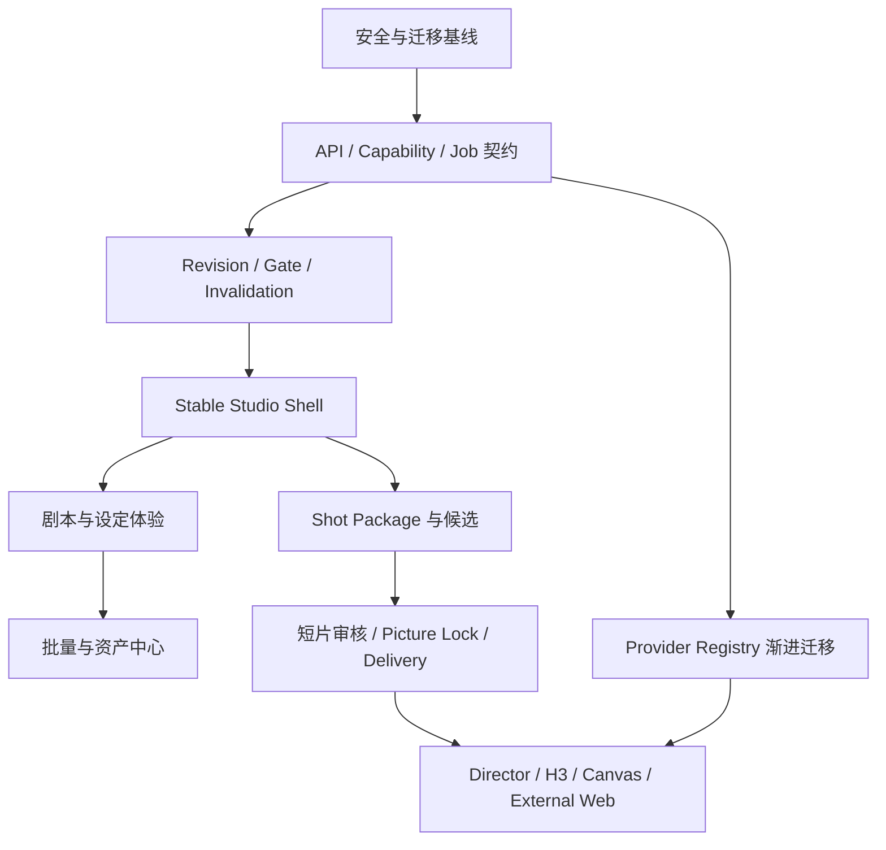

# LocalMiniDrama VNext Scope

> 本文定义 VNext 的产品边界和优先级，不是实施排期。详细评分见 [gap-analysis.md](./gap-analysis.md)，决策理由见 [feature-decisions.md](./feature-decisions.md)。

## 1. VNext 产品定义

LocalMiniDrama VNext 是一个本地优先的单集短剧生产工作台：用户在稳定的 Studio Shell 中完成剧本批准、资产设定、镜头组装、生成选片、整集审核和交付；底层继续使用现有可替换 Provider、本地文件、SQLite、FFmpeg、ComfyUI 和外部协作能力。

VNext 的首要成果不是增加模型数量，而是让用户能可靠回答：

1. 当前项目、单集和阶段是什么？
2. 当前使用的是哪一版剧本、资产和提示词？
3. 哪些下游结果因上游变化而过期？
4. 为什么当前动作可用、禁用或会降级？
5. 一次任务用了什么 Provider、输入和成本，刷新后还能否恢复？
6. 哪个候选被采用，整集是否已经锁定和交付？
7. 结果保存到了候选、资产、分镜还是成片？

## 2. 范围原则

- VNext 是现有产品的演进版本，不是新仓库或数据清零版本。
- P0/P1 重组用户体验时，现有生成能力通过兼容 facade 持续可用。
- 数据和密钥安全是发布能力，不是“工程优化项”。
- Reference 证明工作流模式有价值，不决定我们的商业模式和技术架构。
- P2 能力不阻塞普通用户主流程；Not In VNext 不创建半成品入口。

## 3. P0：安全可迁移的核心闭环

### 3.1 定义

P0 是任何 VNext 用户迁入前必须满足的发布门槛。它同时保护旧能力并建立新工作流所需的最低领域语义。P0 未完成时，不应把新 Studio Shell 作为默认生产入口。

### 3.2 P0 Scope

| 工作包 | Feature IDs | 范围结果 |
|---|---|---|
| 本地产品与主实体保全 | S01、S02、T01 | Electron、本地 SQLite/文件、Project/Episode/Storyboard 和稳定 ID 继续作为基础 |
| 四阶段 Studio 骨架 | S03、S04 | 用户层为剧本/设定/分镜/短片；现有七步能力映射到阶段内，不删除功能 |
| 剧本基线 | C01、C02 | 保留编辑/生成/导入，新增草稿 Revision、批准版本和 Diff |
| Gate 与失效 | C03 | 软浏览、硬执行；上游变化产生带原因的 stale，不删除旧结果 |
| 核心资产 | A01、A09 | 角色/场景/道具和本地上传保持完整，旧媒体路径不变 |
| Shot Package | G01、G02、G03 | 现有分镜、首尾帧、引用槽位、Canonical Reference、声音和 H3 上下文进入统一镜头投影 |
| Provider Capability | G04 | UI、预检、执行和快照使用同一份能力契约；不静默丢参数 |
| 生成能力保全 | G05、G06、G07、G09 | 图像、视频、TTS、候选、历史、选用、恢复保持当前能力 |
| Job Runtime 兼容层 | G10 | 新任务投影支持 unknown/reconciling/partial success；旧任务历史继续可读 |
| 本地后期 | P01 | FFmpeg 音频、字幕、水印与合片继续工作 |
| 可携带性与追溯 | P04、P06 | 项目 ZIP、生成快照和 provenance 不回退；包格式增加版本护栏 |
| 迁移基线 | T02、T07 | migration ledger、schema baseline、历史库升级测试；每类关系指定权威事实源 |
| 安全基线 | T03、T04、T05 | 密钥脱敏、日志 redaction、loopback 默认、移除全局 TLS 绕过 |
| API 契约 | T06 | Versioned schema/错误包；`/api/v1` 提供兼容 facade |
| 验证基线 | T11 | 保持现有 1,264 项测试，补历史库、项目包往返和核心流程 E2E |

### 3.3 P0 必须保护的 Provider/Adapter

P0 回归矩阵至少包含当前已有能力：

- 图像：OpenAI-compatible/Volc、DashScope、Nano Banana、Kling、Gemini；
- 视频：Jimeng、xAI、DashScope、Gemini/Veo、Vidu、Kling/Kling Omni、Volc Omni、Sora、Agnes、MiniMax H3，以及现有兼容 fallback；
- TTS：MiniMax、OpenAI-compatible；
- 工作流：ComfyUI Provider 的现有调用不被 P0 契约改造切断；
- 外部协作：项目/剧集包可继续导入，现有外部生成记录可读；
- 后期：FFmpeg 合片、音频、字幕、水印路径可继续执行。

P0 不要求所有 legacy provider 立即迁入新 Registry。要求是行为有契约测试、能力可描述、旧调用有兼容层。

### 3.4 P0 Release Gates

P0 完成必须同时满足：

- 旧数据库副本可升级、校验、备份和回滚；
- 旧项目的剧本、资产、分镜、媒体、任务历史和包导入结果没有静默丢失；
- 现有 Provider 回归矩阵通过；
- API/日志/导出默认不出现完整 secret；
- 本地独立服务默认不对局域网开放；
- 保存、批准、stale、候选和选用是不同状态；
- 前端超时不会直接把 Provider 任务判为失败；
- 新 Shell 可以展示准确阶段和阻塞原因，但不会在 UI 中复制业务状态。

### 3.5 P0 非目标

- 不完成所有页面的视觉重做；
- 不移除 legacy provider adapter；
- 不规范化全部 46 张表；
- 不实现钱包、团队、社区或发布；
- 不把 H3、Director、Canvas 强制纳入普通流程。

## 4. P1：完整的 VNext 生产体验

### 4.1 定义

P1 在 P0 契约上完成用户可感知的核心体验。P0 是“可安全迁移并正确表达状态”，P1 是“创作者愿意把整集工作放在 VNext 中完成”。

### 4.2 P1 Scope

| 工作包 | Feature IDs | 范围结果 |
|---|---|---|
| 项目入口与详情 | S05、S06 | 按现有输入开始；项目详情展示每集阶段、异常、分镜视频与成片 |
| 短片审核 | S07、P03 | 大播放器、镜头时间线、完成比、Picture Lock、Timeline Revision、Delivery Asset |
| 交互层级 | I01、I02、I03、I05、I06 | 卡片/Drawer/Inspector、保存反馈、批次、通知层级和可访问性统一 |
| 场次语义 | C04 | Story Scene 与视觉 Location 建立兼容映射，不破坏旧 `scenes` 数据 |
| 资产设定 | A02、A03、A04 | Identity/Variant/Candidate 清晰；标准卡片；详情抽屉；重新提取 Merge Preview |
| 风格与声音 | A05、A06 | StyleSpec 视觉选择与影响预览；Voice Profile 试听、候选和绑定 |
| 资产中心 | A07、A08 | 跨项目来源/复制/引用统一；媒体上传、搜索、更新和文件回收契约可用 |
| 批量生产 | G11 | 范围/跳过/能力/成本预检，子任务独立，支持部分成功和仅重试失败 |
| Provider 渐进收敛 | G08、G12、T09 | ComfyUI 被明确保护；供应商按协议逐步进入 Registry，不整体重写 |
| 后处理与开放协作 | P02、P05、P08 | 超分、剧集包、外部 AI 包和结果落点进入统一任务/产物体验 |
| 成本透明 | P07 | 估算、实际/未知、失败计费状态；不实现钱包 |
| 页面与运行时重构 | T08、T10、T12、T13 | 拆分巨型组件；DB/文件补偿；结构化观测；Electron ABI/构建收敛 |
| 遗留清理 | X09、X11 | 删除损坏 FreeCreate 和确认无引用的 stub/queue/隐藏旧流程 |

### 4.3 P1 端到端验收旅程

#### 旅程 A：从现成剧本到首个镜头候选

1. 用户导入剧本并检查解析结果；
2. 保存草稿并批准一个 Revision；
3. 提取资产，在 Merge Preview 中保留人工内容；
4. 选择主形象/语义变体和画风；
5. 创建分镜并打开 Shot Package；
6. Capability 预检引用、时长和规格；
7. 生成候选，刷新应用后继续对账；
8. 选用候选，历史仍可查看。

#### 旅程 B：修改上游后只重做受影响内容

1. 用户修改已批准剧本或角色变体；
2. 系统展示 Diff 与受影响资产/镜头；
3. 用户批准新 Revision；
4. 下游变为 stale，但旧候选不删除；
5. 用户筛选受影响项并只重新编译/生成必要内容。

#### 旅程 C：从多镜候选到成片

1. 用户在短片页查看缺失和未选用镜头；
2. 连续播放已选镜头，替换问题候选；
3. 全镜完成后创建 Picture Lock；
4. 发起 Delivery，查看 FFmpeg/TTS/字幕/超分任务；
5. 成片成为独立资产，可下载、定位来源并保留旧 Delivery。

### 4.4 P1 Release Gates

- 三条验收旅程在桌面应用中通过；
- 200 镜项目的列表/镜头轨采用分页、虚拟化或等效策略并达到既定性能基线；
- 资产标准模式与 Canvas 使用同一 command/query，不产生双写；
- 所有批次展示成功、失败、跳过和未知项；
- Picture Lock 后的修改产生新 Revision，不覆盖旧成片；
- FreeCreate 移除后，仍需要的快速生成能力有明确的统一工具入口或明确不提供。

## 5. P2：高级与可扩展生产能力

### 5.1 定义

P2 属于 VNext，但不阻塞核心版本。它面向高级导演、特殊 Provider 和外部自动化用户，必须建立在 P0/P1 的统一契约上。

| 工作包 | Feature IDs | 范围结果 |
|---|---|---|
| 高级序列交互 | I04 | 镜头拖拽、上下文菜单、键盘重排、撤销和失效反馈 |
| Director 工作流 | G13 | 候选组、质量分析、连续性锚点和 artifact 生命周期稳定化 |
| H3 深度集成 | G14 | 草稿、指纹、语义确认和 provenance 接入 Shot/Capability/Job |
| ChatGPT Web 通道 | G15 | 登录/DOM/浏览器关闭/重复回填场景可恢复，仍为可选通道 |
| 自由画布 | X01 | 标准模式的高级投影，所有写操作复用统一 command 层 |
| OpenClaw | X10 | 从真实 API schema 生成并通过契约测试，不维护手写漂移文档 |

### 5.2 P2 Release Gates

- 关闭任一 P2 功能不会破坏 P0/P1 主流程；
- Canvas 与标准模式切换后数据一致；
- Director/H3 的模型专属失败不会污染通用候选状态；
- 外部网页生成能够辨别 `unknown`、重复结果和登录失效；
- 高级功能均有 feature flag、能力探测和清晰降级。

## 6. Not In VNext

| Feature IDs | 功能 | 决策 | 原因 |
|---|---|---|---|
| X02 | 独立 `external-bridge` 主线接入 | `DEFER` | 与浏览器扩展桥的长期职责未确定 |
| X03 | AI 项目助手 | `DEFER` | 先稳定结构化控制面，避免助手成为唯一操作入口 |
| X04 | 完整 2D 画板 / 3D 导演台 | `DEFER` | 成本高且需求未验证；现有 Canvas/Director 不等于该产品 |
| X05 | 视频重绘 | `DEFER` | 参考内部流程未验证，版权和回写模型未定义 |
| X06 | 云账户、钱包、充值 | `DEFER` | 不符合本地优先核心；成本记录无需钱包 |
| X07 | 团队空间、权限、审批 | `DEFER` | 会重定义身份、数据归属和冲突解决，应独立立项 |
| X08 | 社区、点赞、返利、平台发布 | `DEFER` | 是增长/分发系统，不改善当前生产闭环 |
| X12 | RunningHub 具体品牌视觉 | `REMOVE` | 不复制暗色唯一主题、荧光色、品牌卡片和平台话术 |

Not In VNext 不等于永久否定。重新纳入必须提供用户证据、独立数据模型、任务/失败语义和不破坏本地主线的方案。

## 7. 依赖与顺序

这个顺序表达产品依赖，不要求一个大版本串行完成所有工作。可以按垂直切片交付，但任何切片都不能绕过安全、迁移和统一契约。

## 8. 兼容与迁移承诺

### 8.1 数据

- 不清空或原地猜测旧数据；先备份、迁移、校验，再切换读取。
- 新关系模型采用 backfill + 双读核对 + 停止旧写入 + 最终只读的顺序。
- JSON snapshot 保持不可变；新版本增加 schema version，不批量覆写历史。
- 项目包/剧集包保持向后读取，导出采用新版本 manifest。

### 8.2 Provider

- 每个当前协议建立 capability 与 contract fixture；
- 新 Registry 和 legacy adapter 并行期间，任务快照记录实际执行路径；
- 只有新 adapter 在相同输入上的请求、轮询、错误和产物行为通过后，才停用旧分支；
- Provider 特有字段可保留在 namespaced extension 中，不为“统一”而丢失。

### 8.3 用户工作流

- 旧线性制作台在对应 VNext 阶段通过验收前保持可访问；
- 不在迁移中自动删除候选、覆盖主图或重新生成媒体；
- 阶段门禁只限制执行，不阻止用户查看已有结果；
- 高级能力找不到等价新入口时，保留旧入口或明确延后，不静默消失。

## 9. VNext 成功指标

### 9.1 正确性

- 旧库升级和项目包往返无数据/媒体引用丢失；
- stale 传播可解释且无静默覆盖；
- Job 刷新/重启恢复后状态与 Provider 一致；
- API、日志和普通导出中不包含完整密钥。

### 9.2 工作流

- 用户能从任一深层页面识别项目、集、阶段、当前对象和阻塞原因；
- 从批准剧本到首个可选候选无需在重复页面维护同一资产；
- 上游修改后可以只筛选并重做受影响项；
- 整集交付前能明确识别缺失、未选用和 stale 镜头。

### 9.3 能力保全

- 当前 Provider、ComfyUI、H3、Director、音频、合片、超分、项目包和本地上传均有回归结果；
- Reference 没有的本地能力没有因页面重组而消失；
- P2 功能可关闭，P0/P1 主流程仍完整。

## 10. 最终范围判断

VNext 的范围中心是“生产可信度”，不是功能数量：批准过的输入、可见的依赖、能力匹配的任务、不会覆盖的候选、可恢复的执行和可追溯的交付。P0 建立可信基础，P1 完成创作者工作流，P2 接回高级能力；云账户、社区、视频重绘和完整 2D/3D 工具明确不进入本轮。
